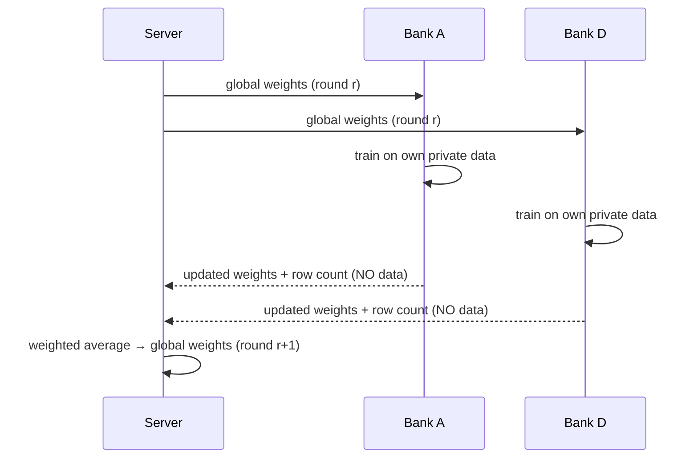
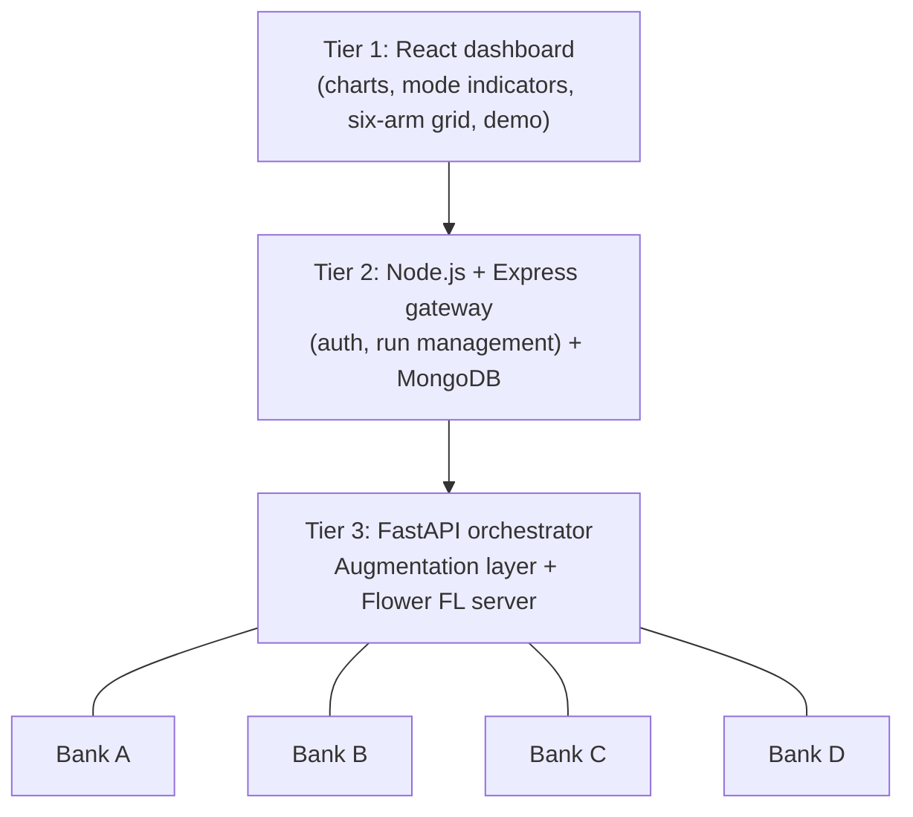

# FraudNet-Synth: The Whole Project, Explained From Zero

> Your main study document for the viva. Read it top to bottom once, then come back to sections as each build step uses them.
> No results appear here. Every number we report later comes from a real run saved under `results/`.

---

## 1. The problem: credit-card fraud detection

Every time someone pays with a card, the bank has a fraction of a second to decide whether the payment is genuine or fraudulent. A **fraud detection model** is a program that looks at a transaction (amount, time, other features) and outputs a score: "how likely is this to be fraud?"

**What makes it hard: fraud is extremely rare.** In the dataset we use (the ULB Credit Card Fraud dataset from Kaggle), well under 1% of transactions are fraud. We will measure the exact figure in Step 1.

**Analogy:** imagine finding a few needles in a stack of hay as big as a house. A lazy guard who says "it's all hay" is right more than 99% of the time and has found zero needles. That's why **accuracy is a misleading metric here**. A model that never flags fraud still scores 99%+ accuracy. So our headline metrics are about the fraud class:

- **Precision:** of the transactions we flagged as fraud, how many really were fraud? (Low precision means annoyed customers with blocked cards.)
- **Recall:** of all the real frauds, how many did we catch? (Low recall means the bank loses money.)
- **F1:** a single number that balances precision and recall. It is high only when both are high.
- **PR-AUC:** how good precision and recall are across *all* possible alarm thresholds, not just one.

Step 1 covers these with worked examples.

---

## 2. Why banks can't simply share data

If four banks pooled all their transactions, they would get a better model: more fraud examples, more patterns. But they can't, because:
- **Law:** data-protection rules (for example India's DPDP Act 2023 and the EU's GDPR) restrict moving personal financial data.
- **Business:** customer data is a competitive asset.
- **Risk:** one central pile of everyone's data is a huge target for attackers.

So each bank is stuck training on its own data. Small banks may only have a handful of fraud examples, which is too few to learn from.

---

## 3. Federated Learning (FL): sharing knowledge, not data

**Federated learning** trains one shared model across many data owners *without the data ever leaving each owner*.

**Analogy: the cooking competition.** Four chefs each have a secret family pantry. They want to write one excellent shared recipe. Instead of carrying their ingredients to one kitchen (sharing data), a coordinator sends each chef the current draft recipe. Each chef cooks with *their own* pantry, tweaks the recipe and sends back *only the tweaked recipe*. The coordinator blends the four tweaked recipes into a new draft and repeats. The pantries never leave home.

In ML terms:
- The **recipe** is the model's **weights**: the numbers inside the model that decide its predictions.
- The **chefs** are **clients**, here our four simulated banks.
- The **coordinator** is the **server**.
- One send-tweak-return-blend cycle is a **round**.

We use **Flower (`flwr`)**, a Python FL framework, to run this. All four banks are simulated on one laptop, but in code each bank can only read its own folder.

### FedAvg: how the server blends
**FedAvg (Federated Averaging)** is the standard blending rule. The new global weights are the **average of the banks' weights, weighted by how much training data each bank has**. For example (illustrative numbers only), a bank with 40,000 rows influences the average more than a bank with 4,000 rows.

**Our privacy invariant:** only model weights and summary metrics ever leave a bank. No data row (real or synthetic) does. We will write an automated test that checks this (Step 8).

---

## 4. Non-IID: why the banks are different

**IID** means "independent and identically distributed": every bank's data looks like a random sample of the same population. Real banks are **non-IID**: a big urban bank sees different fraud than a small rural one, and some banks see far more fraud than others.

**Analogy:** four schools all set an exam on the same subject. In one school almost every student has seen the hard questions, and in another almost none have. Averaging their "knowledge" is harder than if all schools were alike.

Non-IID data makes FL harder: banks pull the shared model in different directions. We deliberately create non-IID shards (Step 2):
- **Banks A and B: data-rich.** They have many fraud examples.
- **Banks C and D: data-poor.** They have very few fraud examples.

---

## 5. Synthetic data: making more examples of the rare class

**Synthetic data** is artificially generated data that imitates the statistics of real data. The idea: if a bank has too few fraud rows, generate extra realistic-looking fraud rows to help the model learn.

**Analogy:** a flight simulator. Pilots can't practise engine failures on real planes very often, so they train on realistic simulations. But a *bad* simulator teaches bad habits. The same is true for bad synthetic data.

FraudNet-Synth uses **two generation modes, chosen per bank by how much real fraud data it has**:

### Augment Mode (Banks A, B): CTGAN
A **GAN (Generative Adversarial Network)** is two neural networks playing a game:
- The **generator** (a forger) makes fake rows.
- The **discriminator** (a detective) tries to tell fake from real.
They train against each other until the forger's fakes are hard to spot.

**CTGAN (Conditional Tabular GAN)** is a GAN designed for tables (rows and columns with mixed, skewed distributions). We use the implementation in the **SDV (Synthetic Data Vault)** library. A GAN needs a reasonable amount of real data to learn from, which is why only data-rich banks use it. Each bank trains its own CTGAN on *its own* fraud rows, inside its own boundary.

### Schema Mode (Banks C, D): an LLM
A data-poor bank has too few fraud rows to train a GAN. Instead we ask a **Large Language Model (LLM)**, accessed via the free tier of **Groq**, to generate rows. The **schema** (column names, types and value ranges) is described in the prompt, plus a few examples or summary statistics.

**Honest caveat:** the dataset's V1–V28 columns are anonymized PCA components with no human meaning, so the LLM is pattern-matching numbers rather than "understanding fraud". We expect it may produce weaker data than CTGAN, and we will report whatever we measure.

**Open privacy question (to decide before Step 5):** sending a bank's real rows to Groq as examples would move real data outside the bank. Options will be presented and decided with the guide.

---

## 6. Why a validation layer is needed

Generators can produce garbage: impossible values, near-copies of real customers (a privacy leak), or the same row over and over (**mode collapse**). So every synthetic row, from either mode, must pass a **shared validation layer** before it may be used for training:

| Check | Tool | Question it answers |
|---|---|---|
| **Fidelity** | SDMetrics | Do synthetic columns and column-pairs statistically resemble the bank's real fraud rows? |
| **Diversity / novelty** | sentence-transformers (+ a numeric distance check we will propose) | Are rows varied, and not near-copies of real rows? |
| **Schema / validity** | Pandera | Correct columns and types, no missing values, values in valid ranges, Class = 1? |

Only passing rows go into `synthetic_validated.csv` for that bank. **Analogy:** a quality-control inspector at a factory gate. Products from two different factories (CTGAN and LLM) pass through the same inspection.

---

## 7. The six experimental arms: what they prove

We don't just build the system. We run a controlled experiment to find out **whether federation helps and whether augmentation helps**, separately and together.

|  | Real data only | Real + validated synthetic |
|---|---|---|
| **Isolated** (each bank alone) | Arm 1: lower bound | Arm 2: augmentation without federation |
| **Federated** (Flower/FedAvg) | Arm 3: federation without augmentation | **Arm 4: full FraudNet-Synth** |
| **Centralized** (all data pooled) | Arm 5: upper bound (not privacy-preserving) | Arm 6: pooled + augmentation |

How to read it:
- **Arm 3 vs Arm 1:** does collaborating via FL beat working alone?
- **Arm 2 vs Arm 1, and Arm 4 vs Arm 3:** does synthetic augmentation help, per bank?
- **Arm 4/3 vs Arm 5/6:** how much performance does privacy cost compared with the illegal "pool everything" ideal?

**Fair comparison rule:** every arm is tested on the *same* held-out global test set of real data. Synthetic data never enters any test set.

**Augmentation is a hypothesis, not a promise.** Some published work reports CTGAN augmentation *hurting* fraud models (to be verified at the source when cited in the report). If augmentation hurts a bank, we report it plainly. That counts as a valid scientific finding.

---

## 8. The system architecture (four tiers)

- **Tier 1:** what users see.
- **Tier 2:** the "front desk": logins, storing run history in MongoDB.
- **Tier 3:** the "engine room": generation, validation and federated training.
- **Tier 4:** the four simulated banks, each with a private data folder.

---

## 9. Constraints we honour
- CPU-only, zero cost (Groq free tier), single laptop.
- No data row crosses a bank boundary, enforced in code and tested.
- Out of scope (Future Scope): graph neural networks, differential privacy, secure aggregation, more than four clients, other datasets.

## 10. The build roadmap
Step 0 setup → 1 data exploration → 2 split and non-IID partition → 3 shared classifier → 4 CTGAN → 5 LLM generation → 6 validation layer → 7 isolated and centralized arms → 8 federated arms → 9 six-arm runner → 10 FastAPI → 11 Express + MongoDB → 12 React dashboard → 13 integration → 14 testing and demo hardening. See `docs/PROGRESS.md`.
