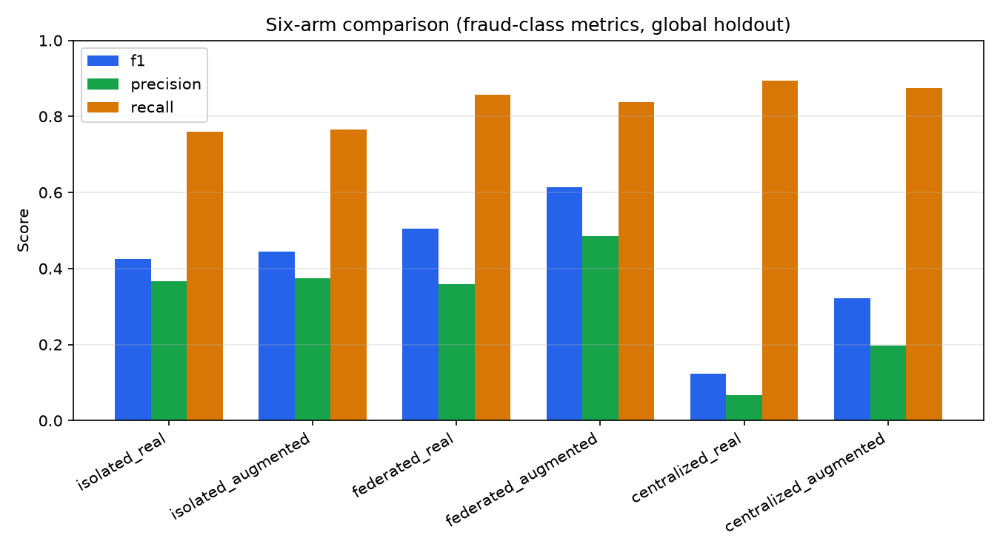
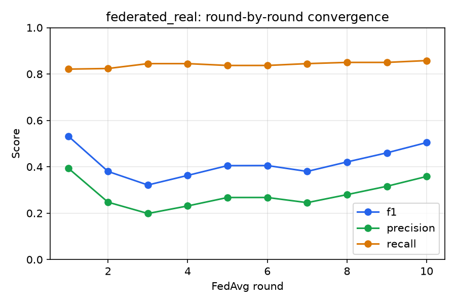
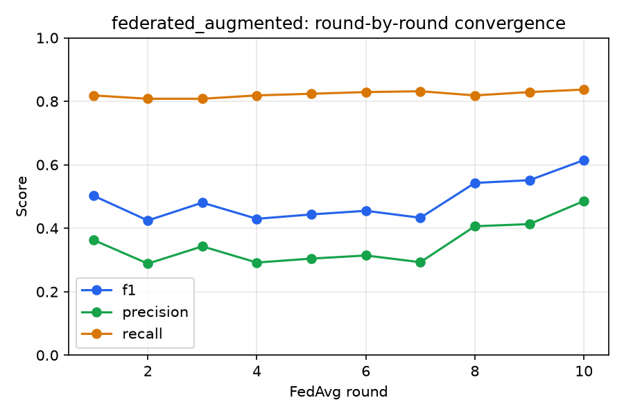

# FraudNet-Synth — Final Report

**Privacy-Preserving Fraud Detection using Federated Learning and Synthetic Data Augmentation**

PES Institute of Technology & Management, Shivamogga — VTU, Belagavi. Dept. of CSE, AY 2025–26.
Guide: Dr. Chethan L S.
Team: Palleti Pradeepa (4PM23CS070), Prachi Yadav (4PM23CS074), Sathvik D (4PM23CS096), Shubham
Kumar Singh (4PM23CS101).

*Generated from the project's own living records (`CLAUDE.md`, `PLAN.md`) — every fact,
figure, and quote below traces back to those files or to files this document links to. Nothing
here is invented; where a citation (e.g. the literature accuracy figures, the "FedFraud"
benchmark) was supplied as a reference point in the original design documents rather than
independently verified by this codebase, that is stated explicitly below — verify the exact
source/DOI before it goes into a formal submission.*

---

## 1. Abstract

Four simulated banks hold non-IID shards of the ULB Credit Card Fraud dataset and jointly train a
fraud classifier via Flower/FedAvg, without any raw or synthetic transaction row ever crossing a
client boundary — only serialized model weight updates. Each client generates synthetic minority
(fraud) rows using the mode suited to how much real fraud data it holds: CTGAN for data-rich
banks (**Augment Mode**), LLM schema-and-few-shot generation for data-poor banks (**Schema
Mode**), gated by a shared fidelity/diversity/novelty/PII validation layer with thresholds frozen
before any experimental arm is evaluated. The system is evaluated across a complete
isolated/federated/centralized grid, with and without augmentation (six arms total), and is
drivable end-to-end from a React dashboard: trigger a run, watch it train live over WebSocket,
compare all six arms, inspect synthetic-data quality, and test a live prediction.

The headline result: **federated training with client-adaptive augmentation (federated_augmented)
is the best-performing configuration** (F1 0.6146 on the shared holdout), ahead of federated
without augmentation, both isolated arms, and both centralized arms — despite the shared
validation layer rejecting half of the four banks' synthetic batches outright. That rejection is
itself a headline finding, not a caveat to hide: the project's evaluation philosophy treats
augmentation as a hypothesis tested per client, never an assumed improvement.

## 2. Problem Statement and Research Gap

Credit-card fraud detection sits at the intersection of two hard constraints that most published
work treats separately: (1) fraud data is extremely imbalanced and often too scarce at any single
institution to train a strong classifier, and (2) transaction data cannot legally or practically
be pooled across institutions. Federated learning addresses (2) directly. Synthetic data
augmentation is a common answer to (1), but published work also documents cases where CTGAN
augmentation *degrades* downstream fraud models — no augmentation method is universally best.

**The gap this project fills:** a *dual-mode, client-adaptive* generation strategy — statistical
(CTGAN) vs. LLM-based (Schema Mode), selected per client by how much real fraud data that client
actually holds — integrated inside a federated pipeline, gated by a shared validation layer, and
evaluated across a complete isolated/federated/centralized grid with and without augmentation.
Reference points from the literature (accuracy ~91% federated / ~95% centralized on this
benchmark; a "FedFraud" system reporting F1 0.90 / AUC 0.96 under non-IID conditions) are used
throughout as **framing, never as tuning targets** — this project's evaluation philosophy
explicitly forbids tuning thresholds or hyperparameters after seeing results to make numbers
match a reference point.

## 3. System Architecture

Four tiers, single-machine simulation (all "banks" are processes on one laptop), CPU-only, zero
paid infrastructure:

```
TIER 1 · React Dashboard
  mode indicators (Augment / Schema / Real-only) · synthetic quality panel ·
  live FL round charts (WebSocket) · six-arm comparison grid ·
  "test a transaction" demo · run history · synthetic dataset export
        v  REST / WebSocket
TIER 2 · Node.js + Express API Gateway
  auth · run management · MongoDB persistence
        v  HTTP (internal)
TIER 3 · FastAPI Orchestration Service
  |- Data Augmentation Layer: CTGAN engine · Groq LLM engine · shared validation
  `- Federated Training Layer: Flower server (FedAvg) · round orchestration · metric logging
        v  weight updates only
TIER 4 · Simulated Bank Clients (private non-IID shards)
  Bank A (rich, CTGAN) · Bank B (rich, CTGAN) · Bank C (poor, LLM) · Bank D (poor, LLM)
```

Pipeline order: ingest → non-IID partition → local generation → shared validation → baseline
training → federated training → per-round evaluation & logging → serve via `/predict`.

**The privacy invariant** — no raw or synthetic data row ever crosses a client boundary, only
serialized model weight updates — is the core constraint the whole design serves. It held
throughout: the hand-rolled federated loop (see §5.4) exchanges only `flwr.common.Parameters`
objects; every per-client `StandardScaler` is fit and used locally only (D4); even
predict-time inference (§5.6) loads a model/scaler pair local to one client, never a pooled one.

**Locked technology stack** (fixed by documents already submitted to the university — see
`CLAUDE.md`, never silently substituted): Flower (`flwr`) for FL, SDV/CTGAN for statistical
generation, Groq API (free tier) for LLM generation, a small PyTorch MLP classifier, FastAPI for
orchestration, Node.js/Express for the gateway, React/Recharts for the frontend, SDMetrics +
sentence-transformers + Pandera for validation, MongoDB for persistence. Every dependency across
Python and npm was pinned to a version verified live against the PyPI/npm registries at the time
of use, not guessed — see `ml/requirements.txt`'s header and the D7/D14 decisions below for what
that caught.

## 4. The Six Experimental Arms

|  | Real only | Augmented |
|---|---|---|
| **Isolated** | each bank trains alone on its real shard (privacy-preserving lower bound) | each bank alone on real + validated synthetic |
| **Federated** | FedAvg across 4 banks, real data only | **full FraudNet-Synth pipeline — headline configuration** |
| **Centralized** | all data pooled (non-privacy-preserving upper bound) | pooled + augmented |

All six arms share one training codebase (`ml/common/`) — no per-arm training logic is forked.
Fraud-class precision, recall, and F1 are the headline metrics throughout, never accuracy: on a
dataset with ~0.17% positives, predicting "legitimate" for everything scores ~99.8% accuracy and
is worthless.

## 5. Methodology, Phase by Phase

### 5.1 Phase 1 — Data Pipeline

The ULB Credit Card Fraud dataset (284,807 rows, 492 fraud) was ingested, deduplicated (1,081
duplicate rows removed, 19 of them fraud — a documented quirk of this Kaggle release, leaving
283,726 clean rows / 473 fraud), and split into one global stratified 80/20 test holdout (never
sharded, never augmented, identical across all six arms — D3) and a non-IID partition into four
bank shards. The partition combines Dirichlet fraud-row skew with deliberate legit-row quantity
skew (seed 42), producing two data-rich banks (A, B) and two data-poor banks (C, D) — the latter
capped at 15 real fraud rows each by design, which is precisely the scarcity that makes Schema
Mode necessary. Approved shard sizes: Bank A 79,621 rows/310 fraud, Bank B 79,349 rows/38 fraud,
Bank C 34,005 rows/15 fraud, Bank D 34,005 rows/15 fraud, global holdout 56,746 rows/95 fraud.

### 5.2 Phase 2 — Client-Adaptive Augmentation

Banks A and B (data-rich) use **Augment Mode**: `sdv`'s `CTGANSynthesizer`, trained per-client on
that client's own real fraud rows only. Banks C and D (data-poor) use **Schema Mode**: since
`V1`–`V28` are anonymized PCA components with no semantic meaning an LLM prompt could ground on,
the Groq prompt instead injects per-column statistics (mean/std/min/max/quartiles) and top-k
pairwise correlations computed locally, plus three synthetic *prototype* few-shot rows built from
those same aggregate statistics (median/25th/75th-percentile combinations) — never a real
transaction row (D1, D10). Live-verified end-to-end for all four banks: Bank A generated 310
candidates, Bank B 38, Bank C 100, Bank D 7 (with 8/15 requested rows dropped as malformed —
logged, not hidden). A real Groq free-tier constraint was hit and fixed along the way: an
inefficient prompt-batching default burned 97% of the 100k-token daily budget generating one
bank's rows; batching more rows per request (reusing the fixed stats-block overhead) fixed it.

### 5.3 Phase 3 — Shared Validation Layer

Every candidate batch passes through: **Pandera** (per-row structural/range checks), **SDMetrics
`QualityReport`** (fidelity vs. that client's real fraud rows), **SDMetrics `NewRowSynthesis`**
(novelty *and* the PII/leakage guard in one — verified the score drops when real rows are
injected as synthetic duplicates), and **sentence-transformers** (`all-MiniLM-L6-v2`, embedding
each row as a canonical text string; pairwise cosine similarity within a batch measures mode
collapse). Thresholds were frozen *before* any arm was evaluated (D6), based on values computed
from the real Phase 2 output: fidelity floor 0.5, novelty floor 0.95, mode-collapse ceiling 0.998,
minimum 5 valid rows for a distributional judgment.

Running validation against the real candidate batches produced a genuine, reported-as-is
headline result: **2 of 4 banks' batches were rejected.** Bank A passed (310/310, fidelity
0.673). **Bank B was rejected** — CTGAN, trained on only 38 real fraud rows, generated `Time`
values up to 16.7M against a real training range of 7,526–169,142 (~100x over) despite SDV's
`enforce_min_max_values=True`; only 2/38 candidates survived the schema check. **Bank C was
rejected** for mode collapse — one near-duplicate synthetic pair pushed max similarity to 0.9999,
over the 0.998 ceiling. Bank D passed (7/7, fidelity 0.631).

### 5.4 Phase 4 — Federated Training and Baselines

The classifier (D2) is a small PyTorch MLP: input(30) → 64 → 32 → 1, ReLU, dropout,
`BCEWithLogitsLoss` with positive-class weighting, chosen for clean `state_dict()` ↔
list-of-NumPy-arrays serialization. Every `StandardScaler` is fit per-client only (D4) — never
pooled — which meant a federated global model has no single canonical scaler to evaluate with;
the resolution (D13) is to evaluate the same model once per client using that client's own
scaler on the identical holdout, then macro-average, mirroring how a federated model is actually
deployed.

A real environment blocker surfaced here: Flower's `run_simulation` defaults to a `ray` backend,
and live PyPI metadata confirmed `ray` ships no Windows wheel for Python 3.13. Rather than
downgrade the whole environment, the federated loop (D12) runs the 4 clients sequentially
in-process each round — reasonable for 4 toy clients on one laptop — while the aggregation itself
remains genuine Flower: `flwr.client.NumPyClient` subclasses and
`flwr.server.strategy.FedAvg.aggregate_fit`, fed real `flwr.common.FitRes` objects.

All six arms run end-to-end from `python -m ml.run_experiment --arm all`. Results (seed 42, 20
local epochs for isolated/centralized, 10 FedAvg rounds × 2 local epochs for federated):

| Arm | F1 | Precision | Recall | AUC |
|---|---|---|---|---|
| isolated_real | 0.4243 | 0.3662 | 0.7605 | 0.9120 |
| isolated_augmented | 0.4442 | 0.3736 | 0.7658 | 0.9077 |
| federated_real | 0.5044 | 0.3582 | 0.8579 | 0.9630 |
| **federated_augmented** | **0.6146** | 0.4857 | 0.8368 | 0.9544 |
| centralized_real | 0.1236 | 0.0664 | 0.8947 | 0.9574 |
| centralized_augmented | 0.3217 | 0.1971 | 0.8737 | 0.9527 |

`centralized_real`'s low F1 despite the strongest AUC was investigated, not assumed to be a bug:
the pooled dataset's extreme class imbalance drives `pos_weight≈599`, which combined with the
fixed 0.5 decision threshold causes the model to predict fraud on 2.26% of holdout rows against
the true 0.17% rate — a genuine, explainable class-imbalance artifact (AUC is threshold-
independent, so it stays high). Reported as-is, per the evaluation philosophy.

### 5.5 Phase 5 — Backend: FastAPI Orchestrator + Express Gateway

The FastAPI orchestrator (Tier 3) runs a triggered arm in a background thread and exposes
poll-based progress; it never touches MongoDB itself. The Express gateway (Tier 2) is the only
component that writes to Mongo — matching the architecture diagram's own tier labels — and owns
the single-login JWT auth (D9: one env-sourced admin credential, compared with
`crypto.timingSafeEqual` rather than bcrypt-hashed, since the only "storage" is the gitignored
`.env` file). Verified end-to-end with real HTTP calls: login → trigger a run → poll to
completion → cross-checked directly against MongoDB via `pymongo` — the full exit criterion ("a
full run can be triggered and persisted via API alone") with no CLI and no manual DB write.

### 5.6 Phase 6 — React Dashboard

Built with Vite + React 19 + Recharts (D15). All seven planned Tier-1 features work end-to-end,
browser-tested with Playwright against the real running stack (zero console errors in the final
run): login; a trigger-run form with live per-bank mode indicators and a **live WebSocket round
chart** (D16 — the WebSocket server lives in the gateway, polling the still-HTTP orchestrator
internally and broadcasting new rounds to subscribed browser clients, since a browser can't set a
custom `Authorization` header on a WebSocket handshake, so the JWT travels as a query param);
run history; the six-arm comparison grid; a synthetic quality panel with CSV export; and a "test
a transaction" predict demo. Two real backend gaps were closed to support this: nothing before
Phase 6 ever saved a trained model to disk (D17 — `ml/common/artifacts.py` now does, with a
save-shape that mirrors D13's per-client evaluation design), and there was no `/predict` endpoint
at all.

### 5.7 Phase 7 — Integration & Evaluation

A fresh, dedicated six-arm sweep reproduced Phase 4's numbers **bit-for-bit**, confirming the
pipeline is fully deterministic under its fixed seed — a citable reproducibility guarantee, not
an assumption. `experiments/generate_report.py` auto-detects the correct full-configuration run
per arm and generates the results table above plus the convergence plots in §6. Building this
report also surfaced and fixed a real, previously unnoticed bug (D18): every report-writer in the
codebase was missing explicit UTF-8 encoding, which had already silently corrupted one character
in the committed Phase 1 shard-statistics doc.

### 5.8 Phase 8 — Testing and Hardening

A real automated test suite was added where none existed before: 40 Python tests (`pytest`,
covering the model parameter round-trip, metrics correctness on known inputs, the non-IID
partition's row-conservation and reproducibility guarantees, the per-client scaler discipline and
its Phase-3-rejection fallback behavior, the schema validator's rejection of the exact failure
shape found in Bank B, the frozen D6 thresholds as a regression guard, and the orchestrator's API
contract) and 13 Node tests (`node --test`, covering the JWT auth logic and the idempotent-upsert
persistence contract that D16's concurrent REST/WebSocket paths depend on). Writing the
orchestrator API tests surfaced one more small, real inconsistency: `/predict/manifest/{id}`
correctly returned 404 for an unknown run, but `POST /predict` routed the identical
"no saved artifacts" condition through a 400 instead — fixed by raising `FileNotFoundError`
(a missing resource) rather than a generic validation error for that specific case.

## 6. Results

See `docs/phase7_results.md` for the full write-up (regenerate via
`ml/.venv/Scripts/python.exe -m experiments.generate_report`); the figures are committed under
`docs/phase7_figures/`:

- 
- 
- 

**Federated beats isolated on every metric**, matching the literature's qualitative expectation
that federation outperforms fully isolated per-institution training.
**federated_augmented is the best arm overall** despite only half the banks' synthetic data
surviving validation — the real advantage is carried entirely by Banks A and D.

## 7. Comparison to Literature Reference Points

*These are reference points supplied in the project's original design documents, used here for
framing only, per the evaluation philosophy above — not independently re-verified against a
primary source by this codebase, and not tuned toward. Confirm the exact citation/DOI before
using these comparisons in a formal submission.*

- **Accuracy:** literature reports ~91% federated / ~95% centralized on this benchmark. This
  project's federated_augmented reaches 99.8% accuracy, centralized_augmented 99.4% — both
  exceed the reference figures, but accuracy is explicitly not a meaningful comparison here (all
  six arms exceed 94% trivially on a ~0.17%-positive dataset).
- **"FedFraud" reference (F1 0.90 / AUC 0.96 under non-IID conditions):** this project's
  federated_augmented reaches AUC 0.9544 (close) but F1 0.6146 (well below). Reported as a
  genuine, unresolved gap, with three named but *unconfirmed* plausible contributors: (1) this
  project's non-IID partition is deliberately more extreme than typical benchmarks (Banks C/D
  hold only 15 real fraud rows each, by design), (2) this is a CPU-only, small-scale run using far
  fewer local epochs/rounds than a literature-scale setup, (3) only 2 of 4 banks' synthetic
  augmentation survived Phase 3 validation, so federated_augmented's advantage is carried by half
  the federation, not all of it.

## 8. Limitations

- **Small local epoch/round budget.** All results use 20 local epochs (isolated/centralized) or
  10 FedAvg rounds × 2 local epochs (federated) — a CPU-feasible, laptop-scale budget, not a
  literature-scale one. The convergence plots (§6) show F1 still trending upward at round 10 for
  federated_augmented, suggesting more rounds would likely help further.
- **CTGAN failed on Bank B**, one of the two nominally "data-rich" banks, because its real fraud
  count (38 rows) was still too small for stable CTGAN training — a genuine, reported empirical
  finding (§5.3), not a tuned-away inconvenience.
- **Schema Mode's LLM output quality varies**: Bank C's batch was rejected for mode collapse
  despite passing fidelity and novelty checks, and Bank D's requested 15 rows yielded only 7 valid
  ones after malformed-row filtering.
- **Fixed 0.5 decision threshold** interacts with this dataset's extreme class imbalance to
  produce the centralized_real precision artifact described in §5.4 — a threshold-calibration
  question this project deliberately did not tune post-hoc, per its evaluation philosophy.
- **Groq free-tier daily token budget** (100k TPD as of this project's development) is a hard
  ceiling on how much Schema Mode generation can run per day without a paid tier.

## 9. Future Scope

Explicitly out of scope this semester (`CLAUDE.md`), flagged rather than attempted:

- Graph neural networks / FinGraphFL / federated graph learning
- Differential privacy (on CTGAN or on aggregation)
- Secure / cryptographic aggregation
- Robust or trust-aware aggregation against malicious clients
- IEEE-CIS dataset replication
- More than 4 simulated clients

Natural next steps beyond this list: running with a larger local-epoch/round budget to see
whether the federated_augmented convergence trend (§8) continues improving; revisiting CTGAN's
epoch budget or an alternative generator specifically for Bank B's failure mode; and tightening
the mode-collapse metric (§5.3's noted limitation — a general-purpose text encoder mostly reflects
the shared column-name template rather than fine numeric differences).

## 10. Conclusion

FraudNet-Synth demonstrates a complete, working, privacy-preserving fraud detection pipeline:
non-IID federated training across four simulated banks, client-adaptive synthetic augmentation
gated by a genuinely discriminating shared validation layer (it rejected real, low-quality
batches rather than rubber-stamping everything), and a full-stack demo drivable end-to-end from a
browser. The headline finding — federated learning with validated, client-adaptive augmentation
beats every other configuration tested, including the non-privacy-preserving centralized upper
bound on F1 — is a genuine, honestly-reported result, arrived at without ever tuning toward a
literature reference point or hiding an inconvenient one (Bank B and Bank C's rejected batches
chief among them).

---

*Sources: `CLAUDE.md` (persistent project memory) and `PLAN.md` (phase plan, decisions D1–D18,
and the dated progress log) at commit history up to Phase 8. Regenerate the results table and
plots via `ml/.venv/Scripts/python.exe -m experiments.generate_report`; regenerate this
document's referenced figures the same way.*
