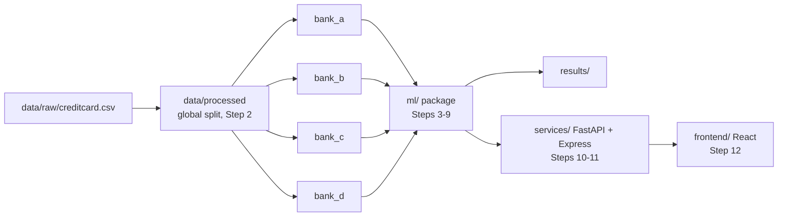

# Step 0: Environment Setup and Project Orientation

## 1. Goal
Prepare a clean, reproducible workspace for FraudNet-Synth before writing any ML code. This means the project folder layout, an isolated Python environment with every library we will need (pinned to exact versions), a working MongoDB connection, git version control, and the dataset in place. We also wrote `docs/PROJECT_EXPLAINED.md`, a beginner-level explanation of the whole project that serves as the main viva study document.

## 2. Concepts explained simply
- **Virtual environment:** a private Python installation just for this project, like a separate toolbox for one job so tools from other jobs don't get mixed in.
- **Pinned versions:** `requirements.txt` records the *exact* version of every library (e.g. `flwr==1.39.0`). Flower and SDV change their APIs between versions, so pinning means the code we write keeps working and anyone can rebuild the same setup.
- **CPU-only PyTorch:** PyTorch normally ships GPU (CUDA) support. We install the CPU-only build because our hard constraint is "no GPU", and it is much smaller.
- **`.env` and `.env.example`:** secrets such as the Groq API key live in `.env`, which git ignores. `.env.example` is a template with empty values that is safe to share.
- **`.gitignore`:** tells git which files never to commit: the raw dataset, data shards, secrets and the virtual environment.

For the big-picture concepts (federated learning, FedAvg, non-IID, CTGAN, LLM generation, validation, the six arms), see [PROJECT_EXPLAINED.md](../PROJECT_EXPLAINED.md).

## 3. What we built
| Item | Purpose |
|---|---|
| Folder layout (`configs/`, `data/`, `ml/…`, `services/`, `frontend/`, `results/`, `tests/`, `docs/`) | Matches CLAUDE.md §5; each later step has a known home |
| `data/clients/bank_a … bank_d/` | Each bank's **private** folder; later, each client may read only its own folder |
| `.venv/` (Python 3.12.10) | Isolated environment |
| `requirements.txt` | 121 pinned packages (from `pip freeze`) plus the CPU-only PyTorch index |
| `.gitignore`, `.env.example`, `README.md` | Hygiene, secret template, setup instructions |
| `docs/PROJECT_EXPLAINED.md`, `GLOSSARY.md`, `DECISIONS.md`, `PROGRESS.md` | Study and tracking documents |



## 4. How to run it
```powershell
py -3.12 -m venv .venv
.venv\Scripts\activate
pip install -r requirements.txt     # includes the CPU-only torch index
python -c "import flwr, sdv, sdmetrics, pandera; print('IMPORT CHECK OK')"
```

## 5. Evidence (real output from this run, 2026-10-02)

**Machine:** Intel i5-12450HX (12 threads), 15.7 GB RAM, no GPU, Windows 11 Pro.

**System tools:**
```
Python 3.13.7 (system default), Python 3.12 (used for the venv)
node v22.19.0 | npm 10.9.3 | git 2.49.0
MongoDB Server v8.0.13 (Windows service, RUNNING)
```

**Required import check:**
```
> python -c "import flwr, sdv, sdmetrics, pandera; print('IMPORT CHECK OK')"
IMPORT CHECK OK
```

**Installed versions (inside `.venv`):**
```
python 3.12.10
torch                  2.14.1+cpu
flwr                   1.39.0
sdv                    1.38.5
sdmetrics              0.32.0
pandera                0.33.1
sentence_transformers  6.1.0
groq                   1.7.0
fastapi                0.138.2
sklearn                1.9.1
pandas                 2.3.3
numpy                  2.5.3
pymongo                4.18.2
ray                    2.55.1
torch CUDA available: False
```

**MongoDB connection from Python:**
```
MongoDB ping: {'ok': 1.0} | server version 8.0.13
```

**Dataset placed:**
```
data/raw/creditcard.csv  144M  284808 lines (1 header + 284,807 rows)
header: "Time","V1",...,"V28","Amount","Class"
```

**Folder tree (excluding .venv and .git):**
```
./configs
./data/clients/{bank_a,bank_b,bank_c,bank_d}
./data/processed
./data/raw
./docs/steps
./frontend
./ml/{augmentation,baselines,data,evaluation,experiments,federated,models,validation}
./results
./services/{gateway,orchestrator}
./tests
```

## 6. Explain it to the guide (script)
"Sir, in Step 0 I set up the workspace for FraudNet-Synth. I created the folder structure where each of the four simulated banks has its own private data folder, which is how we will enforce that no data crosses between banks. I created a Python 3.12 virtual environment and installed the full stack: Flower for federated learning, SDV for CTGAN, SDMetrics and Pandera for validation, sentence-transformers, the Groq client for the LLM, and FastAPI. Everything is CPU-only, and I confirmed that CUDA is disabled. All library versions are pinned in requirements.txt because Flower and SDV change their APIs between versions. I also verified that MongoDB is running and reachable from Python, and that the Kaggle dataset is in place with 284,807 transactions. Finally, I wrote a project explanation document covering federated learning, FedAvg, non-IID data, synthetic data and our six-arm experiment design."

## 7. Likely viva questions
1. **Why a virtual environment?** It isolates the project's libraries and versions from other Python projects, so the setup is reproducible.
2. **Why pin exact versions?** Flower and SDV changed their APIs across versions. Pinning makes sure the code runs the same for anyone, now and later.
3. **Why Python 3.12 and not 3.11?** 3.11 wasn't installed, 3.12 was, and every required library installed and imported on it. This is recorded as decision D-000.
4. **Why CPU-only PyTorch?** It is a project constraint (laptop, zero cost). Our models and dataset are small enough for a CPU.
5. **How does the folder structure support privacy?** Each bank has its own `data/clients/bank_x/` folder, and each federated client will load only its own path. A privacy test in Step 8 will check what clients send.

## 8. Limitations and honest notes
- We deviated from CLAUDE.md's Python 3.11 to 3.12 (approved; see DECISIONS.md D-000).
- `requirements.txt` is a full `pip freeze` (121 packages including sub-dependencies). It is exact but long. A shorter "top-level" list could be added later.
- Installing Flower with `[simulation]` pulls in Ray, a large dependency. Whether we use Flower's Ray-based simulation or another mode will be decided in Step 8 against the installed Flower 1.39 API.
- No ML has been run yet. There are no results.

## 9. Next step
**Step 1: Data ingestion and EDA.** We load `creditcard.csv`, measure the class imbalance, explain the PCA-anonymized V1–V28 features, plot distributions to `results/eda/`, and learn why accuracy is misleading and why precision, recall, F1 and PR-AUC are our headline metrics.
