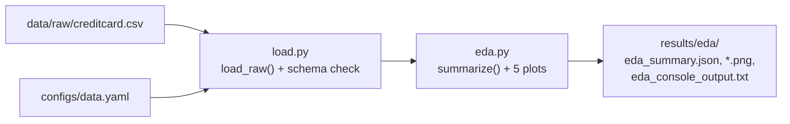

# Step 1: Data Ingestion and Exploratory Data Analysis (Phase 1)

## 1. Goal
Load the ULB Credit Card Fraud dataset, verify that it is complete and correctly formatted, and understand its shape before building anything. We measure how rare fraud is, look at how fraud and genuine transactions differ in Amount, Time and the anonymized V1–V28 features, and save all statistics and charts under `results/eda/`. We also establish why accuracy is the wrong headline metric and introduce the metrics we will use instead.

## 2. Concepts explained simply

### The columns
| Column | Meaning |
|---|---|
| **Time** | Seconds since the first transaction in the file. The file covers 48 hours (two days, September 2013, European cardholders). |
| **Amount** | Transaction amount (currency not stated by the dataset authors; usually assumed to be euros). |
| **V1–V28** | 28 **PCA components**: anonymized features (see below). |
| **Class** | The label: **1 = fraud**, 0 = genuine. |

### What PCA is, and why the features are anonymized
The bank originally had meaningful columns (merchant, location, card type and so on). Publishing those would expose cardholders. So the dataset authors applied **PCA (Principal Component Analysis)**, a mathematical transformation that creates new columns, each a weighted *mix* of all the original columns, ordered so the first ones capture the most variation.

**Analogy: the smoothie.** Blend strawberries, bananas and milk. The smoothie still contains all the information (taste, nutrition), but you can no longer point at "the banana". V1–V28 are the smoothie: still useful for prediction, but "V14" means nothing to a human.

Our data confirms PCA's fingerprints: every V-column has a mean of 0.0 (PCA centres the data), and their standard deviations shrink from 1.959 down to 0.33 (later components carry less variation). Time and Amount were left un-transformed.

**Why this matters later:** in Step 5 an LLM generates fraud rows. Because V-columns have no meaning, the LLM can't use real-world knowledge about fraud. It can only imitate number patterns.

### The accuracy paradox
Our data has 284,315 genuine and 492 fraud transactions. A "model" that answers *genuine* for every transaction is correct on 284,315 / 284,807 = **99.83%** of rows, yet it **catches zero frauds**. Accuracy looks excellent because the hay vastly outnumbers the needles. That's why accuracy is only a secondary metric in this project.

### The metrics we actually use (worked example)
> **Illustrative numbers only, not a result.** Imagine a test set of 100,000 transactions containing 173 frauds (about the real fraud rate). A model flags 150 transactions as fraud, and 120 of those really are fraud.

|  | Predicted fraud | Predicted genuine |
|---|---|---|
| **Actually fraud** (173) | **TP = 120** (caught) | **FN = 53** (missed) |
| **Actually genuine** (99,827) | **FP = 30** (false alarm) | **TN = 99,797** |

This 2×2 table is the **confusion matrix**.
- **Precision = TP / (TP + FP) = 120 / 150 = 0.80.** When we raise an alarm, we're right 80% of the time.
- **Recall = TP / (TP + FN) = 120 / 173 = 0.69.** We catch 69% of all frauds.
- **F1 = 2·P·R / (P + R) = 0.74.** The harmonic mean of precision and recall. It is high only if both are.
- **Accuracy = (120 + 99,797) / 100,000 = 99.92%**, compared with 99.83% for the useless "always genuine" model. Accuracy barely moved, but recall went from 0% to 69%. Accuracy hides exactly what we care about.
- **PR-AUC (area under the precision–recall curve):** a model outputs a fraud *score*, and we choose a threshold above which we raise an alarm. A low threshold gives high recall but low precision, and a high threshold the reverse. PR-AUC summarises precision and recall across *all* thresholds in one number. A random model's PR-AUC equals the fraud rate (≈0.0017), and a perfect model scores 1.0.
- **ROC-AUC:** a related curve-based metric, reported as secondary. On very imbalanced data it can look flattering, because the huge number of true negatives makes the false-positive rate tiny.

### Effect size (Cohen's d)
To find which V-features differ most between fraud and genuine, we use **Cohen's d**: the gap between the two class means divided by a pooled standard deviation. Because genuine rows outnumber fraud rows 578 to 1, the pooled spread is almost exactly the *genuine* class's spread. So d here reads as "how many genuine-class standard deviations away the average fraud lies". We use it only to choose which features to plot, not to select model inputs.

## 3. What we built
| File | What it does |
|---|---|
| `configs/data.yaml` | Raw data path, global seed (42), EDA output folder |
| `ml/data/load.py` | `load_raw()`: loads the CSV and **checks the exact 31-column schema and that Class ∈ {0, 1}**. Every later step loads data through it. |
| `ml/data/eda.py` | Computes statistics, writes `eda_summary.json`, draws five charts |



## 4. How to run it
```powershell
.venv\Scripts\activate
python -m ml.data.eda
```

## 5. Evidence (real output, 2026-10-02)

**Console output** (also saved as `results/eda/eda_console_output.txt`):
```
Shape: 284,807 rows x 31 columns
Dtypes: {'float64': 30, 'int64': 1}
Missing values (all cells): 0
Genuine (0): 284,315 | Fraud (1): 492
Fraud percentage: 0.1727%  (1 fraud per 577.9 genuine)
'Always genuine' accuracy: 99.8273%  <- catches 0 frauds
Duplicate rows: {'total': 1081, 'genuine': 1062, 'fraud': 19}
Time span: 48.0 hours
Amount [genuine]: mean=88.29 median=22.0 max=25691.16
Amount [fraud]: mean=122.21 median=9.25 max=2125.87
Zero-amount transactions: {'genuine': 1798, 'fraud': 27}
V1-V28 std range: [0.33, 1.959], max |mean|: 0.0
Top 6 separating V-features (Cohen's d): V17=-8.318, V14=-7.644, V12=-6.5, V10=-5.35, V16=-4.827, V3=-4.736
Weakest 3: V25=0.08, V23=-0.065, V22=0.019
```

**Amount quartiles** (from `eda_summary.json`):
| Class | 25% | Median | 75% | Mean | Max |
|---|---|---|---|---|---|
| Genuine | 5.65 | 22.00 | 77.05 | 88.29 | 25,691.16 |
| Fraud | 1.00 | 9.25 | 105.89 | 122.21 | 2,125.87 |

**Reproducibility:** two consecutive runs produced byte-identical `eda_summary.json` (MD5 `b7561981e823931fc82a11d01c2182e0` both times).

**Charts** (in `results/eda/`):
| File | What it shows |
|---|---|
| `class_balance.png` | 284,315 genuine vs 492 fraud. The fraud bar is barely visible at linear scale, which is the point. |
| `amount_by_class.png` | Fraud amounts cluster at very small values (a large spike near 1) and near 100, with a long tail. Genuine amounts spread more evenly between ~1 and ~100. |
| `time_by_class.png` | Genuine transactions follow a day/night cycle (dips around hours 0–7 and 25–31). Fraud is relatively more frequent during those low-traffic night hours. |
| `v_feature_separation.png` | \|Cohen's d\| for all 28 V-features. V17, V14, V12 and V10 separate the classes strongly, while V22–V25 and V13/V15 barely differ. |
| `v_features_by_class.png` | Distributions of the 4 strongest and 2 weakest separators. On strong features, genuine rows form a tight peak near 0 and fraud spreads far into negative values. On weak features the two classes overlap almost completely. |

## 6. Explain it to the guide (script)
"Sir, in Step 1 I loaded the ULB credit-card dataset and analysed it before building any model. It has 284,807 transactions over 48 hours with no missing values, but only 492 are fraud, which is 0.17%. That means a model that always says 'genuine' would get 99.83% accuracy while catching zero frauds, so we use precision, recall, F1 and PR-AUC on the fraud class as our main metrics, with accuracy only as secondary. The features V1 to V28 are PCA components. The original bank columns were mathematically mixed to protect cardholder privacy, so they carry no human meaning. My charts show that some of these features, such as V17, V14 and V12, separate fraud from genuine very clearly, while others like V22 barely differ. I also found 1,081 exact duplicate rows, including 19 fraud duplicates, which we must handle carefully when we split the data so the same transaction doesn't appear in both training and test. All numbers and charts are saved under results/eda, and the script gives identical output every run."

## 7. Likely viva questions
1. **Why not use accuracy?** Fraud is 0.17% of the data. Predicting "genuine" always gives 99.83% accuracy with zero frauds caught. Precision, recall, F1 and PR-AUC focus on the fraud class.
2. **What are V1–V28?** PCA components: anonymized linear combinations of the original confidential features. They protect privacy but have no human-interpretable meaning.
3. **Difference between precision and recall?** Precision: of the alarms raised, how many were real fraud. Recall: of all real frauds, how many we caught. The bank trades them off via the decision threshold.
4. **Why PR-AUC rather than ROC-AUC as headline?** With very rare positives, ROC-AUC can look high even for weak models, because the huge number of true negatives keeps the false-positive rate tiny. PR-AUC focuses on the fraud class, and its random-guess baseline equals the fraud rate.
5. **Did EDA on the full dataset leak test information?** No modelling choice was fitted here. EDA is descriptive only. Scalers, generators and thresholds will be fitted only on training or validation data after the Step 2 split.

## 8. Limitations and honest notes
- **Duplicates (open issue for Step 2):** 1,081 rows are exact duplicates of another row (19 among the frauds). If copies land in both training and test sets, test scores are inflated. Handling them is a Step 2 decision.
- **Only 492 fraud rows in total.** After holding out test and validation sets and dividing among four banks, the data-poor banks will have very few fraud examples. This is the scarcity our synthetic-data idea targets, but it also means per-bank metrics will be noisy.
- **Cohen's d values look large** because the pooled spread is dominated by the genuine class (see §2). They are fine for ranking features, but don't read them as "classic" effect sizes.
- **Interpretations are cautious.** The low-amount fraud spike is commonly read as "card testing" (fraudsters trying small charges first), but the anonymized data can't confirm it.
- **Time** is relative seconds over just two days, so it can't capture weekly or seasonal patterns. Whether to use it as a model feature is decided in Step 3.

## 9. Next step
**Step 2: Global split and non-IID partitioning.** We first hold out a global test set and validation set (stratified by Class), then divide the remaining training data among Banks A–D so that A and B are fraud-rich and C and D fraud-poor. You will need to confirm the split ratios, the partition method and how to handle the duplicates found here.
