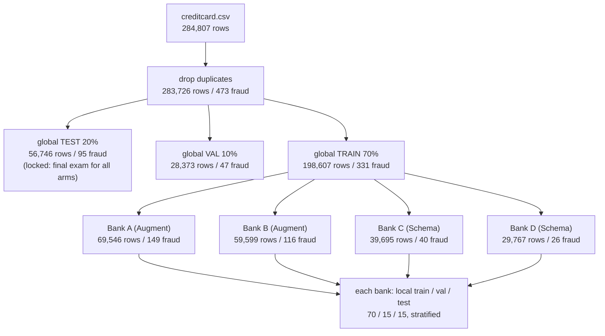

# Step 2: Global Split and Non-IID Partitioning into Banks A–D (Phase 1)

## 1. Goal
Turn one public dataset into a realistic four-bank federated setting without any leakage. We first remove duplicate rows and lock away a **global test set** and **global validation set** that no bank or generator will ever train on. We then divide the remaining training pool among four simulated banks so that **Banks A and B are fraud-rich and Banks C and D fraud-poor**. Finally, each bank splits its own private shard into local train, validation and test sets. Everything is driven by `configs/partition.yaml`, seeded, tested and reproducible.

## 2. Concepts explained simply
- **Hold-out test set:** data locked in a drawer until the very end. If you peek at the exam paper while studying, your exam score no longer measures what you learnt. All six arms are graded on the *same* global test set, which makes the comparison fair.
- **Validation set:** practice tests. We use them to tune things such as the decision threshold, so the real test set stays untouched.
- **Stratified split:** each part keeps the same fraud percentage. Without it, a random 20% test set might by chance get many more or fewer frauds than average.
- **IID vs non-IID:** if we dealt the training rows to banks like shuffled cards, every bank would look the same (IID). Real banks differ, so we deal unequally on purpose:
  - **Label skew:** banks differ in *how much fraud* they hold (A 0.214% fraud vs D 0.087%).
  - **Quantity skew:** banks differ in *size* (A 69,546 rows vs D 29,767).
- **Explicit quotas:** we state what share of each class each bank receives (fraud 45/35/12/8 %, genuine 35/30/20/15 %). It's like a teacher deciding up front how many hard questions each group gets, instead of rolling dice. We chose this over a random **Dirichlet** draw because it *guarantees* the rich/poor pattern our dual-mode design depends on, and the numbers are easy to defend in the viva.
- **Largest-remainder rounding:** 45% of 331 fraud rows is 148.95 rows, but rows are whole. We round down every share, then give the leftover rows to the banks with the biggest fractions, so the counts always add up exactly.
- **Duplicates dropped first:** if two identical rows were split into train and test, the model would be "tested" on a row it had memorised.

## 3. What we built
| File | What it does |
|---|---|
| `configs/partition.yaml` | All Step 2 choices (dedup, ratios, quotas, local split, generator mode per bank) |
| `ml/data/split.py` | `stratified_three_way()` and `global_split()` (dedup, then stratified 70/10/20) |
| `ml/data/partition.py` | `quota_counts()` (exact rounding), `partition_by_quota()` (deal rows to banks), `local_splits()` (each bank's 70/15/15) |
| `ml/data/prepare.py` | Entry point: runs everything, writes CSVs, stats table, chart, SHA-256 manifest |
| `tests/test_partition.py` | 8 tests: no overlap, no duplicates, shards add up to global train, quotas met, A/B > C/D, stratification |



## 4. How to run it
```powershell
.venv\Scripts\activate
python -m ml.data.prepare
pytest tests/test_partition.py -v
```

## 5. Evidence (real output, 2026-10-02)

**Console output** (`results/partition/console_run1.txt`):
```
Rows before dedup: 284,807 | after: 283,726
   set  part   rows  fraud  genuine  fraud_pct
global train 198607    331   198276     0.1667
global   val  28373     47    28326     0.1657
global  test  56746     95    56651     0.1674
bank_a shard  69546    149    69397     0.2142
bank_a train  48682    105    48577     0.2157
bank_a   val  10432     22    10410     0.2109
bank_a  test  10432     22    10410     0.2109
bank_b shard  59599    116    59483     0.1946
bank_b train  41719     82    41637     0.1966
bank_b   val   8940     17     8923     0.1902
bank_b  test   8940     17     8923     0.1902
bank_c shard  39695     40    39655     0.1008
bank_c train  27785     28    27757     0.1008
bank_c   val   5955      6     5949     0.1008
bank_c  test   5955      6     5949     0.1008
bank_d shard  29767     26    29741     0.0873
bank_d train  20836     18    20818     0.0864
bank_d   val   4465      4     4461     0.0896
bank_d  test   4466      4     4462     0.0896

Files written: 15 | combined SHA-256 of all CSVs: 14afc6399f1b0624a11d7228d2dcd564e0041e2b739f4dad268d262a4cdf99e7
```

**Shard summary table:**
| Bank | Mode | Rows | Fraud | Fraud % | Local train fraud | Local val fraud | Local test fraud |
|---|---|---|---|---|---|---|---|
| A | Augment (CTGAN) | 69,546 | 149 | 0.214 | 105 | 22 | 22 |
| B | Augment (CTGAN) | 59,599 | 116 | 0.195 | 82 | 17 | 17 |
| C | Schema (LLM) | 39,695 | 40 | 0.101 | 28 | 6 | 6 |
| D | Schema (LLM) | 29,767 | 26 | 0.087 | 18 | 4 | 4 |

**Reproducibility:** a second run (`console_run2.txt`) is identical line for line, with the same combined SHA-256 `14afc639…99e7`. Per-file hashes are in `results/partition/manifest.json`.

**Tests:** `pytest tests/test_partition.py -v` gives **8 passed**: global splits disjoint, no duplicates, bank files exactly partition global train, no bank row in global val/test, fraud quotas met, A/B > C/D, stratification within 0.01 pp, quota rounding exact.

**Chart:** `results/partition/shard_stats.png` shows fraud rows per bank (149 / 116 / 40 / 26) and fraud % per bank, with a dashed line at the global-train rate of 0.167%. A and B sit above it, C and D below.

## 6. Explain it to the guide (script)
"Sir, in Step 2 I prepared the federated setting. First I removed 1,081 duplicate rows so the same transaction can't appear in both training and testing. Then, before giving any data to the banks, I locked away a global test set of 20% and a validation set of 10%, stratified so each has the same fraud rate of about 0.167%. All six experimental arms will be evaluated on this same test set, which keeps the comparison fair. The remaining 70% was divided among four banks using explicit quotas. Banks A and B received 149 and 116 fraud rows, so they are data-rich and will use CTGAN. Banks C and D received only 40 and 26, so they are data-poor and will use the LLM. Each bank then split its own data into local train, validation and test sets. Eight automated tests confirm that no row appears in two places and that the quotas are met, and running the script twice produces byte-identical files."

## 7. Likely viva questions
1. **Why split off the test set before partitioning?** So no bank, generator or scaler ever sees test data, and all six arms are scored on the identical held-out set. This prevents leakage and keeps the comparison fair.
2. **What makes your data non-IID?** Label skew (fraud rate 0.214% at A vs 0.087% at D) and quantity skew (69,546 vs 29,767 rows). Fraud *count* differs most: 149 vs 26.
3. **Why explicit quotas instead of a Dirichlet split?** Our design requires A/B to be fraud-rich and C/D fraud-poor. Quotas guarantee that, are fully reproducible and are easy to justify. A Dirichlet draw is random and might not produce that pattern.
4. **Why drop duplicates?** Identical rows split across train and test let a model score well by memorisation, which inflates results.
5. **Why does each bank also have a local test set?** To measure how well a model serves *that* bank's own customers, not just the global population. This matters for per-bank fairness, though C and D's local tests are small.

## 8. Limitations and honest notes
- **Very small local fraud counts.** Bank D's local test has only **4** fraud rows and Bank C's has **6**. One missed fraud changes D's local recall by 25 percentage points. Local metrics for C and D will be very noisy, so the global test set (95 fraud) remains the main yardstick, and multi-seed repeats (Step 9) will help.
- **CTGAN will train on few rows.** Bank A's local training set has 105 fraud rows and Bank B's has 82. That is small for a GAN, so expect modest synthetic quality in Step 4.
- **The non-IID-ness is mild in fraud *rate*** (0.087–0.214%) but strong in fraud *count* (26–149). There is no feature skew (banks don't differ in *types* of transactions), because the anonymized data gives no natural way to simulate it honestly. This is a simplification of real banks.
- **Validation data:** we have both a global val set and per-bank local val sets. Which one each arm uses for threshold tuning will be fixed in Step 3/7 and recorded.
- The data CSVs are git-ignored (privacy and size). Anyone can regenerate them with `python -m ml.data.prepare`, and the manifest hashes prove they are identical.

## 9. Next step
**Step 3: Shared classifier and sanity baseline.** We choose one classifier used by every arm (a small PyTorch MLP or a scikit-learn linear model; you will choose), handle class imbalance, write `get_weights`/`set_weights` for Flower, build `metrics.py`, and do a quick sanity run on the global training data.
