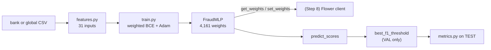

# Step 3: Shared Classifier and Sanity Baseline (Phase 1 → prepares Phase 4)

## 1. Goal
Build the **one fraud classifier that every experimental arm will use**, together with the code that prepares its inputs, trains it, extracts its weights for federated learning and measures it with fraud-focused metrics. We then run a quick **sanity check**: train on the global training data, choose a decision threshold on the global validation data and score once on the global test set. This proves the whole chain works. It is **not** one of the six arms. Those start in Step 7.

## 2. Concepts explained simply
- **One shared model for all arms:** like running every race with the same car. If Arm 4 beats Arm 1, it's because of federation or synthetic data, not because it used a better model.
- **MLP (multi-layer perceptron):** a small neural network. Our version takes 31 numbers per transaction, passes them through a layer of 64 "neurons", then 32, then outputs one fraud score. Each connection has a **weight** (a learnable number). We have **4,161 weights** in total. **ReLU** lets the network learn curved (non-linear) boundaries. **Dropout** randomly switches off 10% of neurons during training so the model can't over-rely on any one of them, which reduces memorising.
- **Loss and weighted loss:** the *loss* is the model's penalty score. The model learns by nudging weights to reduce it. Fraud is rare (331 of 198,607 training rows), so an unweighted model would learn "always say genuine". We multiply the penalty for a missed fraud by **pos_weight = #genuine / #fraud = 599.02**, so both classes count equally in total. Analogy: one fraud mistake costs as much as 599 genuine mistakes, because there are 599 times fewer fraud rows.
  - **Why this choice helps the augmentation experiment:** pos_weight is recalculated from each model's own training data. If a bank adds synthetic fraud rows, its pos_weight drops automatically. So augmentation is tested for adding *new examples*, not just more emphasis.
- **Epoch, batch, learning rate, Adam:**
  - **Batch:** we feed 512 rows at a time.
  - **Epoch:** one pass over all the rows (15 epochs here).
  - **Learning rate:** the step size for each weight update (0.001).
  - **Adam:** a popular method that adapts the step size for each weight.
- **Fixed feature transforms (nothing is "fitted"):**
  - V1–V28 are used as-is (PCA already centred them).
  - Amount becomes **log(1 + Amount)** so huge amounts don't dominate.
  - Time becomes **hour-of-day on a 24-hour circle (sin and cos)**, so 23:59 sits next to 00:00. This captures the night-time fraud pattern from Step 1.

  Because no statistics are learnt from data, there is no leakage, and every bank and arm prepares inputs identically without sharing anything.
- **Threshold tuning:** the model outputs a score between 0 and 1. The default cut-off of 0.5 isn't sacred. We choose the cut-off that gives the best F1 **on validation data only**, then apply it once to the test set.
- **`get_weights` / `set_weights`:** convert the model's weights to and from plain NumPy arrays. In federated learning these arrays are *the only thing a bank sends* to the server (Step 8).
- **PR-AUC (Average Precision):** we compute PR-AUC as *average precision*, the standard step-wise summary of the precision–recall curve.

## 3. What we built
| File | What it does |
|---|---|
| `configs/model.yaml` | Architecture, training settings, imbalance rule, threshold rule |
| `ml/models/features.py` | `to_features()` / `to_xy()`: fixed transforms giving 31 inputs |
| `ml/models/classifier.py` | `FraudMLP`, `build_model()`, `get_weights()`, `set_weights()` |
| `ml/models/train.py` | `set_seed()`, `balanced_pos_weight()`, `train_model()`, `predict_scores()` |
| `ml/evaluation/metrics.py` | `compute_metrics()` (P, R, F1, PR-AUC; ROC-AUC and accuracy secondary; confusion counts), `best_f1_threshold()` (validation only) |
| `ml/baselines/sanity.py` | The sanity run (global train → val threshold → test) |
| `tests/test_model.py` | 8 tests: feature shape, hour periodicity, weight round-trip, metrics vs the Step 1 hand example, threshold, pos_weight, deterministic training |



## 4. How to run it
```powershell
.venv\Scripts\activate
pytest tests/ -q                     # 16 tests (8 from Step 2 + 8 new)
python -m ml.baselines.sanity
```

## 5. Evidence (real output, 2026-10-05)

**Tests:** `16 passed`.

**Sanity run** (`results/sanity_baseline/console_output.txt`, full numbers in `sanity_results.json`):
```
Model: FraudMLP, 4,161 parameters, 31 input features
Train: 198,607 rows, 331 fraud | pos_weight = 599.02 | 15 epochs in 26.1s
  epoch  1  loss 0.5216  val PR-AUC 0.7574
  epoch  5  loss 0.2092  val PR-AUC 0.8621
  epoch 10  loss 0.1249  val PR-AUC 0.7800
  epoch 15  loss 0.0692  val PR-AUC 0.8804
Threshold tuned on global VAL (max F1): 0.9997
```

**Global test set** (95 fraud / 56,746 rows):
| Model / threshold | Precision | Recall | F1 | PR-AUC | ROC-AUC* | Accuracy* | TP | FP | FN |
|---|---|---|---|---|---|---|---|---|---|
| "Always genuine" | 0.0000 | 0.0000 | 0.0000 | 0.0017 | 0.5000 | 0.9983 | 0 | 0 | 95 |
| MLP @ 0.5 | 0.0994 | 0.8737 | 0.1785 | 0.6978 | 0.9622 | 0.9865 | 83 | 752 | 12 |
| **MLP @ tuned 0.9997** | **0.8875** | **0.7474** | **0.8114** | **0.6978** | 0.9622 | 0.9994 | 71 | 9 | 24 |

\*secondary metrics.

**Reproducibility:** a second run produced an identical `sanity_results.json`, ignoring wall-clock time.

**Chart:** `results/sanity_baseline/training_curve.png`. The left panel shows training loss falling steadily from 0.52 to 0.07. The right panel shows validation PR-AUC moving between 0.76 and 0.88 across epochs.

**What the table teaches:**
- At the default 0.5 threshold, the model catches 83 of 95 frauds but raises 752 false alarms. Its *accuracy* (98.65%) is **lower** than "always genuine" (99.83%), even though it is far more useful. This is the accuracy paradox again.
- Tuning the threshold on validation data trades a little recall for much better precision: F1 rises from 0.18 to 0.81.
- ROC-AUC (0.96) looks much rosier than PR-AUC (0.70) on the same scores. This is why PR-AUC is our headline.

## 6. Explain it to the guide (script)
"Sir, in Step 3 I built the single classifier that all six arms will share, so that any difference between arms comes from federation or synthetic data, not from the model. It is a small PyTorch neural network with 4,161 weights, which suits federated averaging because the weights can simply be averaged. Fraud is only 331 of about 198,000 training rows, so I used a weighted loss that makes each missed fraud cost 599 times more, which balances the two classes. The inputs use fixed transforms only: log of the amount and hour-of-day as a circle. Nothing is fitted on data, so there is no leakage and every bank prepares data identically. I also wrote the metric code and the get-weights and set-weights functions that Flower will need. As a sanity check, I trained on the global training data, chose the threshold on validation data, and tested once on the test set: precision 0.89, recall 0.75, F1 0.81 and PR-AUC 0.70. This only proves the pipeline works; it is not one of the six arms."

## 7. Likely viva questions
1. **Why an MLP and not logistic regression?** It can learn non-linear patterns, it is still tiny (4,161 weights), its weights average naturally under FedAvg, and Flower's standard examples use PyTorch.
2. **How do you handle class imbalance?** A weighted loss with fraud weight = #genuine / #fraud of the model's own training data (599 here), plus threshold tuning on validation data.
3. **Why tune the threshold on validation and not test?** Tuning on test would fit the exam itself and give an over-optimistic score. Test data is used once, only for final measurement.
4. **Why did accuracy drop when the model got better at catching fraud?** At threshold 0.5 it raised 752 false alarms out of 56,746 rows, which lowered accuracy below the useless "always genuine" model while catching 83 frauds. Accuracy hides fraud performance.
5. **Why are ROC-AUC and PR-AUC so different?** ROC-AUC counts false positives relative to 56,651 genuine rows, so 752 false alarms look tiny. PR-AUC counts them relative to the fraud alarms raised, so they matter a lot.

## 8. Limitations and honest notes
- **Validation PR-AUC jumps between epochs (0.76 to 0.88).** The global val set has only 47 frauds, so a couple of frauds changing rank moves PR-AUC noticeably. The very large fraud weight (599) also makes training updates noisy. Multi-seed repeats in Step 9 will show the true spread.
- **Val PR-AUC (0.88) is higher than test PR-AUC (0.70).** With 47 and 95 frauds respectively, both estimates are noisy. We do **not** pick epochs or settings by looking at test results; doing so would be leakage.
- **The tuned threshold is 0.9997, very close to 1.** The large fraud weight pushes all scores upward, so the model's scores are good for *ranking* but are not true probabilities. A threshold this close to 1 is sensitive. If it causes trouble in federated or per-bank settings, a softer weight (for example √599) is an option to discuss. It won't be changed without asking you.
- **Fixed 15 epochs, no early stopping.** This is simple and reproducible. Federated local epochs are decided separately in Step 8.
- The training settings (64/32 hidden units, dropout 0.1, learning rate 0.001, batch 512, 15 epochs) are **our proposed values**, recorded as decision D-012, not project specifications.
- This sanity number is **not comparable** to the literature reference points: it is a single centralized run, not one of the six arms.

## 9. Next step
**Step 4: Augment Mode (CTGAN for Banks A and B).** Inside each data-rich bank, we train an SDV CTGAN on that bank's own training fraud rows (105 for A, 82 for B), time it on CPU, generate candidate synthetic fraud rows into that bank's folder and compare real vs synthetic distributions.
