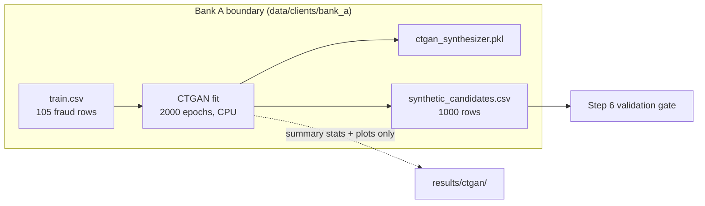

# Step 4: Augment Mode with CTGAN for Banks A and B (Phase 2)

## 1. Goal
Give the two data-rich banks a way to create extra fraud examples without sharing anything. **Inside** Bank A and **inside** Bank B, separately, we train an SDV CTGAN on that bank's own training fraud rows (105 and 82 rows), time it on CPU, and generate 1,000 **candidate** synthetic fraud rows per bank. These are saved only to that bank's private folder. We then compare real vs synthetic distributions honestly. These rows are *candidates*: none of them is used for training until the Step 6 validation gate approves it.

## 2. Concepts explained simply
- **GAN: the forger and the detective.** The *generator* (forger) turns random noise into fake rows. The *discriminator* (detective) looks at rows and judges "real or fake?". They train in turns. The forger improves until the detective can't tell. After training, we keep only the forger and ask it for new rows.
- **CTGAN (Conditional Tabular GAN):** a GAN built for tables. Its key trick for numeric columns is **mode-specific normalisation**: each column is described as a mixture of a few bell curves. This lets it copy lumpy, skewed columns like Amount better than a plain GAN.
- **PacGAN (pac = 10):** the detective looks at 10 rows *together*. If the forger kept producing near-identical rows (**mode collapse**), a pack of 10 would look suspiciously uniform and get caught.
- **Why GAN losses don't fall like a classifier's:** forger and detective are opponents. When one improves, the other's loss rises. A healthy GAN shows losses that *wander and settle* rather than steadily drop. A loss curve proves training ran and didn't blow up. It does **not** prove the data is good. That's what the distribution comparison (here) and the validation layer (Step 6) are for.
- **KS statistic (Kolmogorov–Smirnov):** compares two distributions of one column. 0 means identical shapes and 1 means completely different. Rough guide for our sample sizes (105 vs 1,000): values above about 0.14 suggest a real difference.
- **Edge clamping:** SDV's default `enforce_min_max_values=True` stops synthetic values going outside the real rows' min and max. But instead of *re-drawing* an out-of-range value, it *pushes it onto the boundary*. Many synthetic values then pile up exactly at the edge, which shows as tall spikes at the left or right of the histograms.
- **Privacy in this step:** the CTGAN is trained inside the bank and saved inside the bank (`ctgan_synthesizer.pkl`, git-ignored). Candidates are written only to that bank's folder. Only *summary statistics and plots* go to `results/`.

## 3. What we built
| File | What it does |
|---|---|
| `configs/ctgan.yaml` | Epochs 2,000, batch 500, pac 10, CPU only, 1,000 candidates, columns to plot |
| `ml/augmentation/ctgan_engine.py` | `load_bank_fraud()` (bank's own *training* fraud only), `fit_ctgan()`, `compare()` (KS, correlation gap, copies, duplicates, edge clamping), plots, `run_bank()` |
| `tests/test_ctgan_engine.py` | 3 tests: reads only training fraud rows (a poisoned `test.csv` is never touched), candidates well-formed, in range and reproducible, `compare()` sanity |


(Bank B is identical, with 82 fraud rows.)

## 4. How to run it
```powershell
.venv\Scripts\activate
python -m ml.augmentation.ctgan_engine            # Banks A and B (mode: augment)
pytest tests/test_ctgan_engine.py -q
```

## 5. Evidence (real output, 2026-10-05)

**SDV API used:** sdv 1.38.5 (`sdv.metadata.Metadata.detect_from_dataframe`, `sdv.single_table.CTGANSynthesizer`), ctgan 0.12.1. `enable_gpu=False`.

**Run summary** (`results/ctgan/console_output.txt`):
```
[bank_a] fit 82.5s | sampled 1000 rows in 0.15s | mean KS 0.219 (max 0.466) | mean |corr diff| 0.148 | exact copies of real rows 0 | duplicate synthetic rows 0
[bank_a] edge-clamped: 4.0% of cells, 63.7% of rows | worst: {'V3': 19.3, 'Amount': 14.0, 'V4': 9.6, 'V16': 8.3, 'V18': 7.1}
[bank_b] fit 81.2s | sampled 1000 rows in 0.19s | mean KS 0.223 (max 0.613) | mean |corr diff| 0.153 | exact copies of real rows 0 | duplicate synthetic rows 0
[bank_b] edge-clamped: 5.7% of cells, 79.7% of rows | worst: {'Amount': 55.5, 'Time': 13.8, 'V9': 11.2, 'V7': 11.1, 'V17': 9.4}
```

| Measure | Bank A | Bank B |
|---|---|---|
| Real training fraud rows | 105 | 82 |
| CTGAN training time (2,000 epochs, CPU) | 82.5 s (131.7 s in an earlier identical run) | 81.2 s (123.7 s earlier) |
| Candidates generated | 1,000 (0.15 s) | 1,000 (0.19 s) |
| Mean KS across 30 columns (max) | 0.219 (0.466, V21) | 0.223 (0.613, V19) |
| Mean \|correlation difference\| | 0.148 | 0.153 |
| Exact copies of real rows | 0 | 0 |
| Duplicate synthetic rows | 0 | 0 |
| Rows with ≥1 edge-clamped value | **63.7%** | **79.7%** |

**Means of key columns (real vs synthetic):**
| Bank | Column | Real mean ± sd | Synthetic mean ± sd |
|---|---|---|---|
| A | V14 | −7.02 ± 3.75 | −5.09 ± 3.97 |
| A | V12 | −5.95 ± 4.52 | −6.15 ± 4.96 |
| A | Amount | 159.74 ± 346.59 | 139.19 ± 254.13 |
| B | V17 | −6.65 ± 6.97 | −10.24 ± 6.52 |
| B | Amount | 120.09 ± 207.29 | 46.13 ± 101.51 |
| B | Time | 77,361 ± 48,393 | 106,187 ± 45,155 |

**Reproducibility:** two full runs produced byte-identical `synthetic_candidates.csv` for both banks (MD5 check `OK`). Training time varies with laptop load; the output does not.

**Charts** (in `results/ctgan/`):
- `bank_a_real_vs_synthetic.png` and `bank_b_real_vs_synthetic.png`: the synthetic rows follow the broad *shape* of real fraud. Strong fraud features (V17, V14, V12, V10) stay strongly negative, as in real fraud, and Bank A's V10 matches closely. But there are visible spikes at the edges of the ranges (edge clamping). Bank A misses the real spike of very small amounts (≈1), and Bank B piles 55.5% of its Amounts onto the boundary.
- `bank_a_losses.png` and `bank_b_losses.png`: generator and discriminator losses wander and settle with no divergence or collapse. The discriminator loss hovers near 0 in later epochs.

## 6. Explain it to the guide (script)
"Sir, in Step 4 I built Augment Mode for the two data-rich banks. Inside Bank A, and separately inside Bank B, I trained a CTGAN, a generative adversarial network for tables, using only that bank's own training fraud rows: 105 for A and 82 for B. Each took about one and a half to two minutes on CPU for 2,000 epochs, and each generated 1,000 candidate fraud rows. The trained generator and the candidates stay inside the bank's folder; only summary statistics leave. None of the synthetic rows is an exact copy of a real row and there is no duplication, so there is no obvious mode collapse. The synthetic rows follow the broad shape of real fraud, especially in the strongest fraud features. But the quality is clearly imperfect: the average KS distance is about 0.22, and because SDV clamps out-of-range values to the boundary, 64% of Bank A's rows and 80% of Bank B's have at least one value stuck at an edge. That's expected with only around 100 training rows, and it is exactly why every row must pass the validation layer in Step 6 before it is used."

## 7. Likely viva questions
1. **Why does each bank train its own CTGAN?** Training it centrally would need the banks' fraud rows in one place, which breaks the privacy invariant. Each bank's generator learns only from its own data and never leaves its folder.
2. **Why only Banks A and B?** GANs need a reasonable amount of data. With 28 and 18 training fraud rows, Banks C and D are too small, so they use Schema Mode (LLM) in Step 5.
3. **Why so many epochs?** With about 100 rows and batch size 500, ctgan performs one training step per epoch, so 2,000 epochs means only 2,000 updates, and it is cheap on CPU (~1.5–2 minutes).
4. **Do decreasing losses mean good data?** No. Generator and discriminator are opponents, so their losses don't steadily fall. Quality is judged by comparing distributions (KS here, SDMetrics in Step 6).
5. **Is "0 exact copies" enough to prove privacy?** No. A row can be a *near*-copy of a real one. Step 6 adds a distance-to-closest-record and embedding similarity check for that.

## 8. Limitations and honest notes
- **Fidelity is moderate, not high.** Mean KS is 0.22 and several columns exceed 0.3 (e.g. Bank B's V19 at 0.613 and Amount at 0.501). With 82–105 training rows this is expected, and it is a finding, not a failure.
- **Edge clamping is a real artefact.** 63.7% (A) and 79.7% (B) of rows have at least one value forced onto a real min/max. This comes from SDV's default `enforce_min_max_values=True`. We did **not** change it silently. Options for Step 6, to decide with you: let the gate reject heavily clamped rows; switch clamping off (values may then leave the valid range, which the Pandera check would catch); or keep it as-is and report it.
- **Bank B's synthetic Amounts are much smaller than real** (mean 46 vs 120), and its Times skew later. Training a classifier on such rows could teach it wrong amount patterns. Step 7 will measure whether augmentation helps or hurts, per bank.
- **Training time varies run to run** (82 s vs 132 s for Bank A) because of laptop load. The *output* is byte-identical.
- No near-duplicate or memorisation check yet. That's Step 6.

## 9. Next step
**Step 5: Schema Mode (LLM) for Banks C and D.** Before writing any code, we must resolve the **privacy decision** in CLAUDE.md §2.5: whether the Groq prompt may contain a bank's real fraud rows as examples, or only the schema plus aggregate statistics. You also need a Groq API key in `.env` and a chosen free-tier model name.
