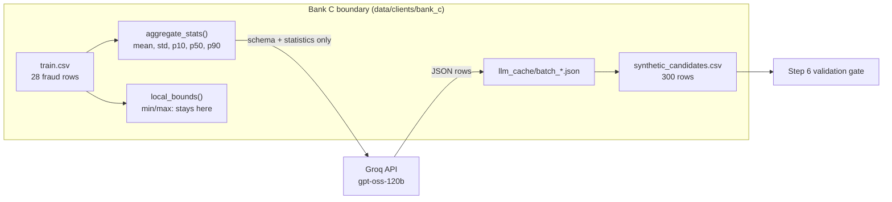

# Step 5: Schema Mode with an LLM for Banks C and D (Phase 2)

## 1. Goal
Give the two data-poor banks (Bank C: 28 training fraud rows, Bank D: 18) a way to get extra fraud examples when they have too little data to train a GAN. Each bank computes **summary statistics of its own fraud rows locally**. It sends **only those statistics and the public table schema** to an LLM (Groq free tier, model `openai/gpt-oss-120b`) and asks for new synthetic fraud rows. We generated **300 candidate rows per bank**, cached every API response inside the bank's folder, and measured how realistic the rows are. As in Step 4, these are *candidates*: Step 6's validation gate decides which may be used.

## 2. Concepts explained simply
- **The privacy decision (option b, D-015):** no real transaction ever goes to Groq, only aggregates like "the average V14 among our frauds is −6.84". **Analogy:** describing your class's exam results to an outside tutor as "average 62, middle mark 58, spread 12" instead of handing over the mark sheet. We also **withheld min and max**. With only 18–28 rows, the minimum *is* one real transaction's exact value.
- **Prompt engineering:** designing the instructions so the LLM returns what we need. Our prompt has three parts: the schema (column names, meanings, valid ranges), the statistics table, and strict rules (spread values like the distribution, vary rows, exact output format).
- **Zero-shot plus statistics:** *few-shot* would mean showing example rows. We show none (privacy), only numbers *about* the rows.
- **Tokens and rate limits:** LLMs count text in *tokens*. Groq's free tier allowed **8,000 tokens per minute**, and in practice also had a **daily cap** (we hit it at roughly 190,000 tokens). Our code paces calls, retries with **exponential backoff** (wait 2, 4, 8 … seconds) and **caches** every reply, so a stopped run resumes exactly where it left off.
- **Structured output (strict JSON schema):** we tell Groq the exact JSON shape we expect. Groq checks the reply and rejects it if it doesn't match.
- **Why the LLM is a weak generator for this data:** V1–V28 are PCA numbers with no meaning, so the LLM can't use any knowledge of fraud. It can only write numbers that *look* like they fit the statistics. LLMs are also known to be poor at producing truly random numbers, which we measured (below).

## 3. What we built
| File | What it does |
|---|---|
| `configs/llm.yaml` | Privacy mode, allowed statistics, schema facts, 300 candidates, 15 rows/call, pacing, retries, output format |
| `ml/augmentation/schema_stats.py` | `aggregate_stats()`: mean/std/p10/p50/p90 only, **refuses** anything else (e.g. min). `local_bounds()`: exact min/max, local use only |
| `ml/augmentation/llm_engine.py` | `build_prompt()` (receives only the stats dict, never the dataframe), `response_format_for()` (strict schema), `parse_rows()`, `call_with_backoff()`, `patterned_decimal_pct()`, `generate_for_bank()` (cache → API → parse → save) |
| `tests/test_llm_engine.py` | 8 tests: no min/max in stats, a disallowed stat is refused, **no real value in the prompt**, **no bound in the prompt**, parsing and reject counting, bad JSON, strict-schema shape, digit-pattern detector. No network needed. |
| `results/llm/bank_x_stats_sent.json` | **Exactly** what left each bank (auditable) |
| `results/llm/bank_x_prompt_example.txt` | The full prompt text |


(Bank D is identical, with 18 fraud rows.)

## 4. How to run it
```powershell
.venv\Scripts\activate
# .env must contain GROQ_API_KEY and GROQ_MODEL
python -m ml.augmentation.llm_engine          # Banks C and D; resumes from cache, so no API calls if already complete
pytest tests/test_llm_engine.py -q            # no network needed
```

## 5. Evidence (real output, 2026-10-07 / 08)

**Free-tier limits observed (response headers):** 1,000 requests/day, 8,000 tokens/minute. A daily token cap was also hit during Bank D (Groq asked for 13–20-minute waits), and generation resumed from the cache the next day.

**Getting the output format to work (evidence in `results/llm/attempt*.json`):**
| Attempt | Format | What happened |
|---|---|---|
| 1 | Plain JSON mode, rows as 30-number arrays | Asked for 25 rows: got 30 rows of **29** numbers, then 22 rows of 30/31 numbers. All rejected. |
| 2 | Strict schema, rows as arrays | Groq rejected the reply: 27 rows, **18 of them with 31 numbers**. 6 rows repeated another row's V1–V28. |
| 3 | Strict schema, named fields, exactly 15 rows | Rejected: 12 rows returned instead of 15 |
| **4 (final)** | Strict schema, named fields, **1–15 rows** | ~13 valid rows per call, almost no rejects |

**Final run** (`results/llm/console_output.txt`, rebuilt from the cache with **0 API calls**):
```
[bank_c] 300 candidates from 25 batches | tokens 127,683 | API time 263.0s | parse rejects {'bad_json': 1, ...}
[bank_c] mean KS 0.26 (max 0.595) | mean |corr diff| 0.493 | exact copies 0 | duplicate rows 0 | rows outside real min/max 23.3% (cells 1.6%)
[bank_c] patterned decimals (e.g. .123/.432): LLM 68.9% vs real 1.8% (chance ~1.6%)
[bank_d] 300 candidates from 25 batches | tokens 125,848 | API time 5041.3s | parse rejects {'bad_json': 1, 'time_out_of_range': 1, ...}
[bank_d] mean KS 0.252 (max 0.493) | mean |corr diff| 0.493 | exact copies 0 | duplicate rows 0 | rows outside real min/max 21.3% (cells 1.8%)
[bank_d] patterned decimals (e.g. .123/.432): LLM 63.6% vs real 1.6% (chance ~1.6%)
```
(Bank D's "API time" includes the long rate-limit waits on day 1. The 'bad_json' reject in each bank is one reply that failed Groq's schema check.)

**Comparison with Augment Mode (CTGAN, Step 4):**
| Measure | A (CTGAN) | B (CTGAN) | C (LLM) | D (LLM) |
|---|---|---|---|---|
| Real training fraud rows | 105 | 82 | 28 | 18 |
| Candidates | 1,000 | 1,000 | 300 | 300 |
| Mean KS (lower = closer) | 0.219 | 0.223 | 0.260 | 0.252 |
| Mean \|correlation difference\| | 0.148 | 0.153 | **0.493** | **0.493** |
| Exact copies / duplicates | 0 / 0 | 0 / 0 | 0 / 0 | 0 / 0 |
| Patterned decimals (chance ≈ 1.6%) | 1.5% | 1.7% | **68.9%** | **63.6%** |
| Tokens / CPU time | 82.5 s CPU | 81.2 s CPU | 127,683 tokens | 125,848 tokens |

**Means of key columns (real vs LLM):**
| Bank | Column | Real mean ± sd | LLM mean ± sd |
|---|---|---|---|
| C | V14 | −6.84 ± 4.50 | −7.06 ± 3.58 |
| C | Amount | 124.79 ± 240.70 | **288.99** ± 313.08 |
| D | V14 | −7.86 ± 4.88 | −7.80 ± 3.55 |
| D | Amount | 125.64 ± 196.20 | **206.98** ± 196.46 |

**Charts:** `results/llm/bank_c_real_vs_synthetic.png` and `bank_d_real_vs_synthetic.png`. The strong fraud features (V17, V14, V12, V10) land in roughly the right region, with slightly narrower spread than real. Amount is clearly wrong: the LLM misses real fraud's spike of tiny amounts (≈1) and produces too many large ones.

## 6. Explain it to the guide (script)
"Sir, in Step 5 I built Schema Mode for the two data-poor banks, which have only 28 and 18 fraud rows, too few to train a GAN. To keep our privacy rule, each bank computes only summary statistics locally — mean, standard deviation and three percentiles per column — and sends those with the table schema to a Groq-hosted LLM. No real row ever leaves the bank. I even withheld min and max, because with so few rows those are exact real values, and my tests check that no real value appears in the prompt. Getting reliable output took four attempts: the LLM kept miscounting the 30 columns, so I switched to strict JSON with named fields, which made almost every row valid. Each bank got 300 candidate rows, and every response is cached so the demo never needs the internet. The honest result is that the LLM rows match each column's centre and spread reasonably, but they lose the relationships between columns: the correlation error is 0.49, against 0.15 for CTGAN. About two-thirds of the numbers also follow artificial digit patterns like 5.432, which shows the LLM is writing number-shaped text rather than realistic data. Step 6 will decide which rows are good enough to use."

## 7. Likely viva questions
1. **How does Schema Mode protect privacy if it uses an external API?** Only aggregate statistics and the public schema are sent. No row, and not even min/max (which would be single real values). The code enforces this: the prompt builder never receives the data, the stats function refuses non-approved statistics, and tests check the prompt for real values.
2. **Why use an LLM instead of CTGAN for Banks C and D?** With 18–28 fraud rows a GAN can't learn a distribution. An LLM can produce rows from a description alone. Comparing the two modes is part of our research gap.
3. **Why did the first attempts fail?** The LLM couldn't keep count of 30 unlabelled numbers per row, and it returned wrong row counts. Strict JSON with named fields and a flexible row count fixed it.
4. **What does the 0.49 correlation difference mean?** Real fraud columns move together in certain ways. The LLM only received per-column statistics, so it generated each column almost independently and lost those relationships. CTGAN, which learns from the rows directly, kept them much better (0.15).
5. **How do you make sure the demo works without internet?** Every API reply is cached in the bank's folder. Rerunning rebuilds the candidates from the cache with zero API calls, as the final run shows.

## 8. Limitations and honest notes
- **Lost correlations (0.49).** This is a direct, expected consequence of the privacy choice (no correlations sent). Sending the strongest correlations is a possible improvement to discuss with you; it would still be aggregate-only.
- **Patterned digits (63.6–68.9% vs ~1.6% by chance)** persisted *despite* a prompt instruction against them. The values are low-entropy, "number-shaped" text. A classifier could learn this artefact, but since synthetic rows go only into training (never into test), any harm would show up as worse test scores in Step 7.
- **Amounts are too large** (means 289 and 207 vs real ~125), and the real spike of tiny amounts is missing.
- **About 21–23% of rows have at least one value outside the bank's real min/max.** This is expected, because we deliberately didn't send min/max. Step 6's range checks will decide what's acceptable.
- **Not reproducible bit-for-bit.** LLM outputs vary even with a fixed seed. The cached responses *are* the reproducible artefact: rebuilding from the cache gives identical candidates.
- **Pool sizes differ** (300 LLM vs 1,000 CTGAN) because of the free-tier token budget (D-017).
- **Free-tier daily cap:** the run spanned two days. The exact daily limit wasn't shown in the response headers; it was inferred from the 13–20-minute retry-after waits at about 190k tokens.
- **Privacy caveat to disclose:** even aggregates from 18–28 rows carry *some* information about those rows. This is far weaker than sending rows, but it is not formal privacy (that would need differential privacy, which is Future Scope).

## 9. Next step
**Step 6: Shared validation layer.** Both modes' candidates pass through the same gate: SDMetrics fidelity, sentence-transformers diversity/novelty (plus a proposed numeric distance-to-closest-record check), and Pandera schema/range checks. Only passing rows go into `synthetic_validated.csv`. Open decisions for Step 6: how to treat CTGAN's edge-clamped rows, and the thresholds.
