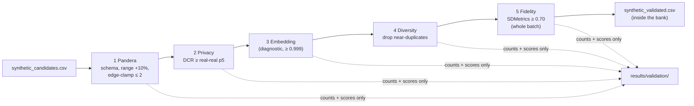

# Step 6: Shared Validation Layer (Phase 3)

## 1. Goal
Make sure no synthetic row reaches a model unless it passes the **same inspection**, whichever way it was made (CTGAN or LLM). Every candidate from Steps 4 and 5 is checked for valid schema and range (Pandera), privacy (not a near-copy of a real fraud), diversity (not a near-copy of another synthetic row), and set-level fidelity (SDMetrics). The sentence-transformers embedding check is also computed, as specified, but used as a diagnostic. Passing rows are written to `data/clients/bank_x/synthetic_validated.csv` **inside each bank**, and per-bank pass rates and rejection reasons are reported. Everything runs inside each bank's boundary: thresholds come from the bank's own real fraud rows, and only aggregate counts and scores reach `results/`.

## 2. Concepts explained simply
- **Validation gate:** an airport security line. Passengers from two different airlines (CTGAN and LLM) go through the same scanners. Fail any check and you don't board (join the training pool).
- **Schema and range check (Pandera):** Pandera lets us write down what a valid table looks like: exactly these 30 columns plus Class, all numbers, no blanks, Class = 1, each value inside the bank's real range widened by a 10% margin. **Honest note on "PII":** ULB contains no names, card numbers or addresses (it's already anonymised), so there is no personal information to detect. Our "PII/schema" check is really a schema and range check.
- **Edge clamping:** CTGAN pushed out-of-range values onto the exact real min/max (Step 4). A row with **3 or more** such stuck values is rejected; 1–2 are tolerated.
- **Distance to closest record (DCR):** we measure how far each synthetic row is from the nearest real fraud, after *standardising* each column (subtract the mean, divide by the spread, so every column counts equally). **Analogy:** in a classroom photo, if a "new" student stands in exactly the same spot and pose as a real student, it's probably a copy. The threshold isn't a guess: it's the **5th percentile of how close real frauds sit to each other** in that bank. A synthetic row closer to a real row than real frauds normally are to one another is treated as a possible near-copy (a privacy risk).
- **Diversity (mode collapse):** using the same distance, if a synthetic row is almost identical to one we already kept, it adds no new information, so we drop it.
- **Fidelity (SDMetrics QualityReport):** scores the *whole kept set* against the bank's real fraud (0 to 1, higher is better). **Column Shapes** asks whether each column has the right distribution. **Column Pair Trends** asks whether pairs of columns move together like in real data. Because it scores a set, not individual rows, it can only accept or refuse a bank's batch as a whole (minimum 0.70).
- **Embedding check (sentence-transformers):** each row is written as text ("Time=…, V1=…") and turned into a meaning-vector by a small language model (all-MiniLM-L6-v2). **Flagged as unusual:** numeric rows written as text all look alike to a sentence model. We measured cosine similarity of 0.96–0.995 for synthetic↔real, real↔real and synthetic↔synthetic pairs alike. So it is kept as specified and reported, but only rejects essentially identical text (≥ 0.999). The numeric DCR check makes the real decisions (D-021).

## 3. What we built
| File | What it does |
|---|---|
| `configs/validation.yaml` | All thresholds and rules (shared by both modes) |
| `ml/validation/schema_checks.py` | `build_schema()` (Pandera schema from the bank's local bounds, margin and clamp rule), `schema_failures()` (per-row reasons), `edge_clamped_counts()` |
| `ml/validation/diversity.py` | `standardise()`, `real_nn_distances()`, `dcr()`, `greedy_dedupe()`; embedding helpers `rows_as_text()`, `embed()`, `max_cosine()` |
| `ml/validation/fidelity.py` | `quality()`: SDMetrics QualityReport (overall, Column Shapes, Column Pair Trends) |
| `ml/validation/gate.py` | Runs the five stages per bank, writes `synthetic_validated.csv` in the bank folder, plus per-bank JSON reports, a summary CSV and a chart |
| `tests/test_validation_gate.py` | 7 tests: valid rows pass; out-of-range, missing and wrong-class rows are caught; the 10% margin; the clamp rule (3 rejected, 1 tolerated); DCR flags near-copies; dedupe keeps the first of a close pair; text format |



## 4. How to run it
```powershell
.venv\Scripts\activate
python -m ml.validation.gate                 # all four banks; works offline once the embedding model is cached
pytest tests/test_validation_gate.py -q
```

## 5. Evidence (real output, 2026-10-08)

**Validation report** (`results/validation/validation_summary.csv`, `console_output.txt`):
| | Bank A | Bank B | Bank C | Bank D |
|---|---|---|---|---|
| Mode | Augment (CTGAN) | Augment (CTGAN) | Schema (LLM) | Schema (LLM) |
| Candidates | 1,000 | 1,000 | 300 | 300 |
| **Validated** | **868** | **814** | **234** | **264** |
| **Pass rate** | **86.8%** | **81.4%** | **78.0%** | **88.0%** |
| Rejected: out of range / schema | 0 | 0 | 29 | 27 |
| Rejected: edge-clamped (3+ values) | 132 | 186 | 0 | 0 |
| Rejected: too close to a real row | 0 | 0 | 0 | 0 |
| Rejected: identical text embedding | 0 | 0 | 0 | 0 |
| Rejected: near-duplicate synthetic row | 0 | 0 | 37 | 9 |
| Rejected: batch fidelity < 0.70 | 0 | 0 | 0 | 0 |
| SDMetrics overall: all candidates | 0.8331 | 0.8434 | 0.7552 | 0.7530 |
| SDMetrics overall: **validated** | 0.8041 | 0.8002 | 0.7461 | 0.7559 |
| Column Shapes (validated) | 0.7766 | 0.7763 | 0.7143 | 0.7397 |
| Column Pair Trends (validated) | 0.8317 | 0.8242 | 0.7780 | 0.7720 |
| DCR threshold (real-real 5th pct) | 0.495 | 1.582 | 1.067 | 0.922 |

**Pass rate by mode:** Augment (CTGAN) 1,682 / 2,000 = **84.1%**; Schema (LLM) 498 / 600 = **83.0%**.

**Out-of-range detail (LLM banks):** Bank C's rejections were mostly Amount (19 rows) and V2 (9); Bank D's mostly Time (19) and V20 (6).

**Privacy evidence (DCR, standardised units):**
| Bank | Closest synthetic→real (1st pct) | Real→real nearest (5th pct) | Synthetic→synthetic nearest (median) | Real→real nearest (median) |
|---|---|---|---|---|
| A | 2.860 | 0.495 | 3.522 | 2.677 |
| B | 2.899 | 1.582 | 3.475 | 2.975 |
| C | 2.052 | 1.067 | 1.394 | 3.574 |
| D | 2.570 | 0.922 | 1.445 | 3.512 |

Even the closest 1% of synthetic rows are further from any real fraud than real frauds typically are from each other, so there is no sign of memorisation. The LLM rows sit much closer to *each other* (median 1.4) than real frauds do (3.5): low diversity.

**Embedding diagnostic:** median cosine synthetic→real 0.986 / 0.987 / 0.986 / 0.985, versus real→real 0.986 / 0.987 / 0.984 / 0.987. Indistinguishable, as flagged.

**Report-only patterned decimals:** CTGAN validated 1.5% / 1.7% (real 1.5% / 1.7%); LLM validated 68.4% / 62.8% (real 1.8% / 1.6%).

**Reproducibility:** a second run produced byte-identical `synthetic_validated.csv` for all four banks (MD5 check OK) and needed no internet.

**Chart:** `results/validation/gate_outcomes.png`, a stacked bar per bank of passed vs each rejection reason.

## 6. Explain it to the guide (script)
"Sir, in Step 6 I built the shared validation layer that every synthetic row must pass before training, whether it came from CTGAN or the LLM. It has five stages. Pandera checks the schema and that every value is inside the bank's real range with a 10% margin, and it rejects CTGAN rows with three or more values stuck on a boundary. A distance-to-closest-record check rejects any row that is closer to a real fraud than real frauds are to each other, which would suggest copying. The same distance removes near-duplicate synthetic rows. Finally, SDMetrics scores the fidelity of the kept set. I also ran the sentence-transformers embedding check from our design, but I found that numeric rows written as text all look alike to it, with similarity around 0.98 for every pair, so I use it only as a diagnostic and let the numeric distance check decide. The pass rates were 86.8% and 81.4% for the CTGAN banks and 78% and 88% for the LLM banks. No row was a near-copy of a real transaction. The CTGAN rejections were mostly edge clamping, while the LLM rejections were out-of-range values and near-duplicate rows."

## 7. Likely viva questions
1. **Why one shared gate for both modes?** So the comparison between Augment and Schema mode is fair: the same rules decide what counts as acceptable synthetic data.
2. **How do you detect privacy leakage without labelled "leaks"?** With distance to closest record. The threshold is the 5th percentile of real-to-real nearest distances within the same bank, so "too close" is defined relative to how real frauds naturally cluster.
3. **Why not rely on sentence-transformers as specified?** We measured it. Text versions of numeric rows score 0.96–0.995 similarity for every kind of pair, so it can't separate copies from normal rows. We kept it as a diagnostic and added a numeric check, and we document this choice.
4. **What does "PII check" mean on an anonymised dataset?** There is no personal information in ULB, so it reduces to schema and range validation: correct columns, types, no missing values, Class = 1, plausible ranges.
5. **Why can SDMetrics only accept or refuse a whole batch?** It measures distributions of a *set* of rows, not individual rows. So it's applied to the admitted set as a whole, with a minimum score of 0.70.

## 8. Limitations and honest notes
- **For CTGAN, filtering lowered the fidelity score** (A: 0.833 → 0.804, B: 0.843 → 0.800, mostly in Column Pair Trends). Removing edge-clamped rows removes many extreme values, and real fraud does have extreme tails. So the clamp rule trades a lower SDMetrics score for removing artificial boundary spikes. We report this rather than tuning the rule to raise the score.
- **The LLM rows that pass are still low-diversity** (median synthetic spacing 1.4 vs 3.5 for real) and still patterned (63–68%). The diversity filter only removes rows *closer than* the threshold (about 1.0). It doesn't make the remaining set as spread out as real data.
- **Thresholds come from tiny samples.** Bank D's privacy threshold comes from 18 real rows: its 1st and 5th percentiles are both 0.922, set by a single close pair. Small-sample thresholds are noisy.
- **The SDMetrics minimum (0.70)** is our choice. All banks cleared it (lowest 0.746), so it didn't affect this run.
- **Validated pool sizes differ a lot:** 868 / 814 rows for CTGAN banks vs 234 / 264 for LLM banks. How many validated rows each bank actually adds in training (the augmentation ratio) is a Step 7 decision.
- **Passing the gate doesn't mean the rows help.** Whether they improve fraud detection is tested in Step 7 (isolated) and Step 8 (federated), per bank.

## 9. Next step
**Step 7: Isolated and centralized arms.** Arms 1 and 2 train each bank alone on real data, then on real + validated synthetic data. Arms 5 and 6 pool all banks' training data (real only, then real + synthetic). Everything is scored on the same global test set and each bank's local test set. Decisions needed: the augmentation ratio (how many validated rows each bank adds) and which validation set tunes each arm's threshold.
