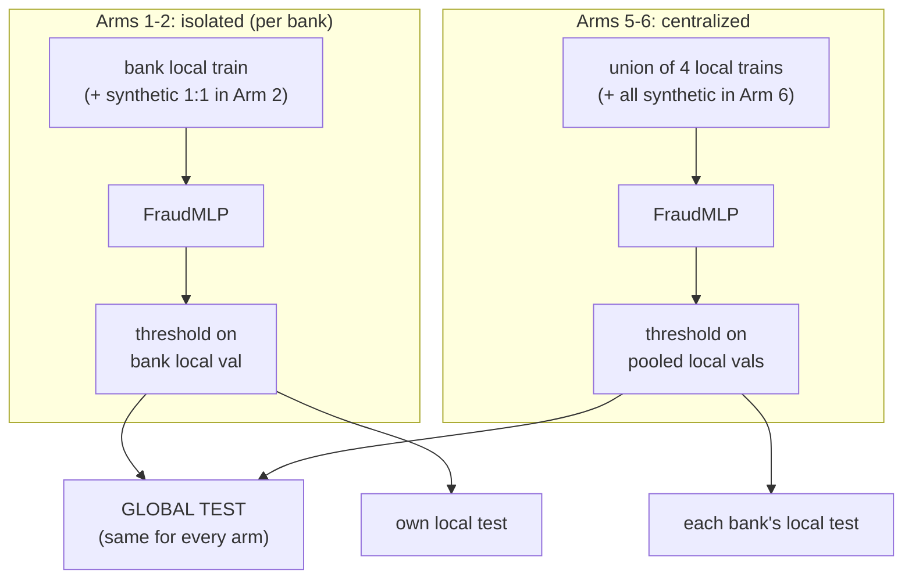

# Step 7: Isolated and Centralized Arms (Phase 4)

## 1. Goal
Run four of the six experimental arms with the shared classifier: **Arm 1** (each bank alone, real data), **Arm 2** (each bank alone, real + validated synthetic fraud), **Arm 5** (all banks' data pooled, real only) and **Arm 6** (pooled + synthetic). Every model is scored on the **same global test set** (95 frauds among 56,746 transactions) and on each bank's own local test set. These give the lower bound (isolated) and the upper bound (centralized) that the federated arms in Step 8 will be compared against. They also give the first per-bank test of whether synthetic data helps. This step also found and fixed a scoring bug (D-028).

## 2. Concepts explained simply
- **Isolated (Arms 1, 2):** each bank is a student studying alone from their own notes. Small banks (C, D) have very few fraud examples, so they're expected to do worst.
- **Centralized (Arms 5, 6):** all notes photocopied into one book. In real life this is **illegal**: banks can't pool customer transactions, because of data-protection law, competition and security risk. It's only a *reference point*: the best we might hope federated learning can approach.
- **Augmentation ratio 1:1 (D-025):** each bank adds exactly as many validated synthetic fraud rows as it has real training fraud rows (A +105, B +82, C +28, D +18), sampled from its validated pool. Because the loss is balanced (D-010), real fraud still carries half of the fraud weight.
- **Paired comparison:** every model starts from identical initial weights (same seed). Real-only vs augmented therefore differ *only* in the training data.
- **Owner's validation (D-026):** a model tunes its threshold on the validation data its owner would actually have. Isolated banks use their own local val (A 22, B 17, C 6, D 4 frauds); the pooled model uses all four banks' local vals combined (49 frauds).
- **Avoiding a leakage trap (D-027):** the pooled model trains on the union of the banks' *local train* sets (139,022 rows). The global train file (198,607 rows) also contains every bank's local val and test rows, so using it would put local test rows into training.
- **Logit scores (D-028):** the model's raw score before the sigmoid. Ranking by logit gives the same order as by probability, but without the rounding ties described in §8.

## 3. What we built
| File | What it does |
|---|---|
| `configs/experiments.yaml` | Augmentation ratio, threshold source, centralized pooling rule, seeds, results folder |
| `ml/baselines/arms.py` | `sample_synthetic()`, `fit_and_evaluate()` (train → tune threshold on val → score every evaluation set), `run()` (Arms 1, 2, 5, 6), tables (global, local, augmentation delta) and chart |
| `ml/models/train.py` (changed) | `predict_scores()` now returns float64 logits; new `predict_proba()` for display only (D-028) |
| `ml/baselines/sanity.py` (changed) | default cut-off is logit 0 (= probability 0.5); Step 3 numbers re-run |
| `tests/test_model.py` (+1 test) | confident predictions keep distinct, untied scores |



## 4. How to run it
```powershell
.venv\Scripts\activate
python -m ml.baselines.arms        # ~3-4 minutes on CPU
pytest tests -q
```

## 5. Evidence (real output, seed 42, 2026-10-08)
Full output: `results/arms_isolated_centralized/console_output.txt`. Data: `results_seed42.json`, `global_test_table.csv`, `local_test_table.csv`, `augmentation_delta_table.csv`. Chart: `f1_prauc_global_test.png`.

**Training data per model:**
| Model | Rows | Fraud (real + synthetic) | Val fraud for threshold |
|---|---|---|---|
| Bank A | 48,682 / 48,787 | 105 / 105 + 105 | 22 |
| Bank B | 41,719 / 41,801 | 82 / 82 + 82 | 17 |
| Bank C | 27,785 / 27,813 | 28 / 28 + 28 | 6 |
| Bank D | 20,836 / 20,854 | 18 / 18 + 18 | 4 |
| Pooled | 139,022 / 139,255 | 233 / 233 + 233 | 49 |

**Global test set (95 frauds). Headline metrics first; ROC-AUC and accuracy are secondary:**
| Arm | Model | Precision | Recall | **F1** | **PR-AUC** | ROC-AUC | Accuracy | TP / FP / FN |
|---|---|---|---|---|---|---|---|---|
| 1 Isolated real | Bank A | 0.8333 | 0.7895 | **0.8108** | 0.7120 | 0.9551 | 0.9994 | 75 / 15 / 20 |
| 1 Isolated real | Bank B | 0.8947 | 0.7158 | **0.7953** | 0.7145 | 0.9567 | 0.9994 | 68 / 8 / 27 |
| 1 Isolated real | Bank C | 0.8689 | 0.5579 | **0.6795** | 0.7124 | 0.9336 | 0.9991 | 53 / 8 / 42 |
| 1 Isolated real | Bank D | 0.7879 | 0.2737 | **0.4062** | 0.6861 | 0.9381 | 0.9987 | 26 / 7 / 69 |
| 2 Isolated aug | Bank A | 0.7653 | 0.7895 | **0.7772** | 0.7039 | 0.9550 | 0.9992 | 75 / 23 / 20 |
| 2 Isolated aug | Bank B | 0.8933 | 0.7053 | **0.7882** | 0.7275 | 0.9589 | 0.9994 | 67 / 8 / 28 |
| 2 Isolated aug | Bank C | 0.8689 | 0.5579 | **0.6795** | 0.7095 | 0.9347 | 0.9991 | 53 / 8 / 42 |
| 2 Isolated aug | Bank D | 0.8095 | 0.3579 | **0.4964** | 0.6718 | 0.9357 | 0.9988 | 34 / 8 / 61 |
| 5 Central real | Pooled | 0.8919 | 0.6947 | **0.7811** | 0.7231 | 0.9667 | 0.9993 | 66 / 8 / 29 |
| 6 Central aug | Pooled | 0.8788 | 0.6105 | **0.7205** | 0.7248 | 0.9620 | 0.9992 | 58 / 8 / 37 |

**Augmentation delta on the global test (augmented minus real only):**
| Model | Mode | ΔPrecision | ΔRecall | **ΔF1** | **ΔPR-AUC** |
|---|---|---|---|---|---|
| Bank A | CTGAN | −0.0680 | 0.0000 | **−0.0336** | −0.0081 |
| Bank B | CTGAN | −0.0014 | −0.0105 | **−0.0071** | +0.0130 |
| Bank C | LLM | 0.0000 | 0.0000 | **0.0000** | −0.0029 |
| Bank D | LLM | +0.0216 | +0.0842 | **+0.0902** | −0.0143 |
| Pooled | both | −0.0131 | −0.0842 | **−0.0606** | +0.0017 |

**Local test sets** (fraud counts: A 22, B 17, C 6, D 4). F1 / PR-AUC:
| Local test of | Arm 1 (own, real) | Arm 2 (own, aug) | Arm 5 (pooled, real) | Arm 6 (pooled, aug) |
|---|---|---|---|---|
| Bank A | 0.7727 / 0.7431 | 0.7727 / 0.7356 | 0.7027 / 0.6819 | 0.6667 / 0.7260 |
| Bank B | 0.6857 / 0.6130 | 0.6471 / 0.7113 | 0.6667 / 0.6135 | 0.7059 / 0.6239 |
| Bank C | 0.8000 / 0.9762 | 0.9091 / 1.0000 | 0.9091 / 1.0000 | 0.8000 / 1.0000 |
| Bank D | **0.0000** / 0.4939 | **0.0000** / 0.4977 | **0.7500** / 0.6220 | 0.3333 / 0.6458 |

Bank D's own model caught **0 of its 4** local test frauds; the pooled model caught 3 of 4.

**Run time:** 199.7 s for all ten models.

## 6. Explain it to the guide (script)
"Sir, in Step 7 I ran four of our six arms with the same neural network: each bank alone with and without synthetic data, and one pooled model with and without synthetic data. The pooled model is only an upper-bound reference, because pooling customer data across banks would be illegal. Every model was tested on the same global test set of 95 frauds. Isolation clearly hurts the small banks: Bank D, with only 18 training frauds, reached an F1 of 0.41, while Bank A reached 0.81. Interestingly, their PR-AUC ranking quality is similar, so much of the damage comes from choosing a threshold with only 4 validation frauds. Adding synthetic data at a 1:1 ratio gave mixed, small effects: F1 went down slightly for Bank A, stayed the same for C, and rose by 0.09 for Bank D, while PR-AUC moved by at most 0.014 either way. Since these are single-seed results, I don't claim augmentation helps or hurts yet; Step 9 repeats everything over several seeds. I also found and fixed a scoring bug where very confident predictions were rounded to exactly 1.0 and tied, which had been under-reporting PR-AUC."

## 7. Likely viva questions
1. **Why is centralized called an upper bound, and why is it illegal?** It sees everyone's data, the most information possible. In practice, data-protection law, competition and security risk stop banks from pooling customer transactions, so it is a reference point, not a deployable system.
2. **Why did the centralized model score a lower F1 than Bank A alone?** In this single-seed run, its threshold (tuned on 49 pooled val frauds) traded recall for precision (0.69 recall vs 0.79). Its PR-AUC, which doesn't depend on the threshold, is the highest (0.723), but only by about 0.01. Step 9's multi-seed runs will show whether the gap is real or noise.
3. **Did synthetic data help?** Not consistently. F1 changes ranged from −0.06 to +0.09, and PR-AUC changes were within ±0.015. One seed can't separate a small effect from noise, so we report it as inconclusive for now.
4. **Why tune thresholds on each owner's own validation data?** That's realistic: an isolated bank only has its own data. It also shows an honest cost of isolation: Bank D tuned on just 4 frauds and set its threshold too strictly.
5. **Why train the pooled model on local train sets, not the global train file?** The global train file also contains the banks' local validation and test rows. Training on it would leak those into training and inflate the local-test scores.

## 8. Limitations and honest notes
- **Bug found and fixed (D-028):** scores were float32 probabilities. With the large fraud weight, confident predictions saturated to exactly 1.0. In one model, 49 test transactions (41 of the 95 frauds) tied at the top score, losing ranking information. Scores are now float64 logits. Effect: P/R/F1 unchanged, **PR-AUC was being under-reported** (e.g. the Step 3 sanity check went from 0.6978 to 0.7272; Step 3's doc carries a correction note). Pre-fix outputs are kept as `console_output_before_D028.txt`.
- **Single seed.** All differences here (augmentation deltas, centralized vs Bank A) are small enough to be noise. No conclusion about augmentation should be drawn before Step 9.
- **Small banks' F1 is dominated by threshold noise.** PR-AUC is similar across banks (0.686–0.714 isolated), but F1 ranges from 0.41 to 0.81. Bank D's threshold came from 4 validation frauds.
- **Local test sets are tiny** (C: 6 frauds, D: 4). One fraud changes D's local recall by 25 points, so local numbers are illustrative only.
- **Centralized isn't clearly above isolated** in this run: F1 0.781 vs Bank A's 0.811, though PR-AUC is 0.723 vs 0.712. Possible reasons: one seed, a fixed 15 epochs (D-012) for every dataset size, and the pooled training set (139k rows) being smaller than Step 3's global train (198k).
- **Augmentation hurt the pooled model's F1** (−0.061), through lower recall at its tuned threshold. PR-AUC was essentially unchanged (+0.002). Reported plainly; not tuned away.
- **No literature comparison yet.** The reference points (≈91% federated vs ≈95% centralized accuracy; FedFraud F1 0.90) are discussed in Step 9, once all six arms have multi-seed results. Accuracy is not our headline: every model here is ≥ 99.87% accurate, including the weakest.

## 9. Next step
**Step 8: Federated arms with Flower.** We'll walk through one FedAvg round, build the Flower client (each bank loads only its own folder) and server, and run Arm 3 (federated, real only) and Arm 4 (federated, real + validated synthetic, the headline FraudNet-Synth configuration), logging metrics every round. We'll also add the privacy-invariant test proving clients send only weights and scalar metrics. Decisions needed: number of rounds, local epochs per round, and how the federated threshold is chosen from aggregated validation counts.
