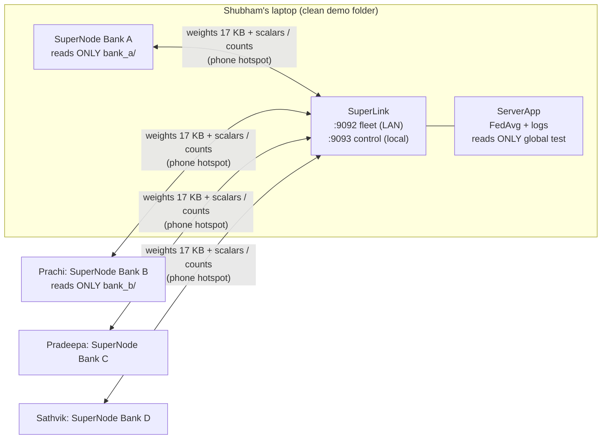

# Step 8B: Multi-Device Federated Demo (live demo only)

## 1. Goal
Show, as our guide asked, that the fraud model **really travels between separate machines over a network** while each bank's data never leaves its own laptop. We moved from Flower's *simulation* (Step 8) to its **deployment** mode: a SuperLink server on Shubham's laptop and one SuperNode per bank, talking over a phone hotspot. We built a checked handover of each bank's ready-made files, a start-up check that refuses to run on a laptop holding anything but its own bank, per-round logs on both sides, and a single-command one-laptop fallback that uses the same code path. **This is a demo. Every reported result comes from the single-machine runs (Steps 7–9).**

**Test status:**
| Test (8B.3) | Status |
|---|---|
| 1. One-laptop fallback (5 processes, one command) | ✅ **Passed** 2026-10-10 (10 rounds, logs in `results/demo_8b/fallback_20261010_185747/`) |
| 2. Two laptops (Shubham + Prachi) on a phone hotspot | ⏳ **Not yet run.** It needs Prachi's laptop in person; procedure in §4.3 |
| 3. All four laptops on one hotspot | ⏳ **Pending, planned for Monday** |

## 2. Concepts explained simply
- **Simulation vs deployment:** in Step 8, Flower *pretended* there were four banks inside one program. In deployment, each bank is a **separate program**, potentially on a separate laptop, and messages really cross the network. **Analogy:** a cricket net session with one bowler pretending to be four, versus a real match with four players on the field.
- **SuperLink:** the server-side "post office". Banks connect to it on port **9092** (the *Fleet API*). `flwr run` connects to it on port 9093 (the *Control API*, bound to the server laptop only, so nobody else can start runs).
- **SuperNode:** the program each bank runs. It connects to the SuperLink, receives work (train / evaluate / query), runs our `ClientApp` on *its own* data, and replies.
- **`--node-config "bank='bank_b'"`:** how a SuperNode says which bank it is. Our client reads only `data/clients/<that bank>/`.
- **FAB (Flower App Bundle):** when Shubham types `flwr run`, Flower zips up our **code** and ships it through the SuperLink to every SuperNode, so all banks run identical code. We restricted it to `ml/**/*.py` and `configs/*.yaml`. The built bundle has 35 Python files, 9 YAML files and `pyproject.toml`, **154 KB, with no CSV or JSON**. So code travels, data never does.
- **Row fingerprint:** a hash of all values in a row. Our CSVs have no ID column, so fingerprints are how the export proves which rows are which.
- **Insecure mode (no TLS):** messages travel unencrypted on the hotspot. They contain only model weights and counts, but encryption (TLS certificates) would be needed in real life. That's a disclosed limitation.
- **Firewall inbound rule / client isolation:** Windows blocks incoming connections by default, so only the server laptop needs a rule for port 9092. Some phones block device-to-device traffic on their hotspot ("AP/client isolation"); if so, use another phone.

## 3. What we built
| File | What it does |
|---|---|
| `pyproject.toml` | The Flower App definition: components, demo run settings (arm 4, 10 rounds, expected banks), and `fab-include` restricted to code + configs |
| `configs/demo.yaml` | Ports (9092 fleet, 9093 control, 9094+ local runtime), demo defaults, export file list, sandbox paths |
| `ml/data/load.py` (changed) | `DATA_ROOT`: where data lives (the project by default; each demo process gets its own folder) |
| `ml/federated/client_app.py` (changed) | Deployment mode: bank from `--node-config`, **start-up data check once before the first round** (refuses on failure), per-round log `Round N: received … -> trained on R rows (F fraud) -> sent weights back (X KB)` |
| `ml/federated/server_app.py` (changed) | Settings from the run config; waits for `expected-banks`; logs every arriving message's bank, record types and size, plus the threshold-count step; demo results saved separately (never over experiment results) |
| `ml/federated/demo/bankfiles.py` | Manifest, SHA-256, row fingerprints, allowed-file list |
| `ml/federated/demo/export_bank.py` | Builds `exports/bank_x.zip` (root folder `bank_x/`) **only if** every fingerprint check passes |
| `ml/federated/demo/check_my_data.py` | Visible evidence and enforcement that a laptop holds only its own bank |
| `ml/federated/demo/start_server.py`, `start_client.py`, `run_demo.py` | The three commands for the multi-laptop demo |
| `ml/federated/demo/make_demo_folder.py` | Builds Shubham's clean demo folder (fresh clone + Bank A + global test only) |
| `ml/federated/demo/fallback.py` | **One command**: isolated sandbox per process, all data checks, SuperLink + 4 SuperNodes, `flwr run`, log collection, shutdown |
| `tests/test_demo_checks.py` | 9 tests: a clean laptop passes; **refused:** another bank's file, a tampered file, extra files (e.g. candidates), the raw Kaggle file, the global train split, the global test set on a client, the wrong bank name; global test allowed only on the server laptop |
| `docs/MULTI_DEVICE_SETUP.md`, `docs/DEMO_SCRIPT_8B.md` | Teammate setup guide (Windows, beginner level) and the 5-minute script with roles |



## 4. How to run it

### 4.1 Prepare (main working folder, once)
```powershell
.venv\Scripts\activate
python -m ml.federated.demo.export_bank --all       # exports\bank_a..d.zip, each fingerprint-checked
```

### 4.2 One-laptop fallback (single command)
```powershell
python -m ml.federated.demo.fallback                 # 10 rounds, ~6 min; logs -> results\demo_8b\fallback_<time>\
```

### 4.3 Two-laptop test (Shubham + Prachi): procedure to follow
1. Prachi completes `docs/MULTI_DEVICE_SETUP.md` Parts 1–2 (install, receive `bank_b.zip`, `check_my_data` → OK).
2. Shubham: `make_demo_folder --dest C:\Projects\fraudnet-demo` and the firewall rule (Part 4).
3. Both join Shubham's phone hotspot. Prachi runs `Test-NetConnection <server-IP> -Port 9092` → `True`.
4. Shubham: window 1 `start_server`; window 2 `start_client --bank bank_a --server 127.0.0.1 --server-laptop`.
5. Prachi: `start_client --bank bank_b --server <server-IP>`.
6. Shubham: window 3 `run_demo --expected-banks 2`.
7. **Record:** copy Shubham's `C:\Projects\fraudnet-demo\results\demo_8b\` and Prachi's `results\demo_8b\client_bank_b.log` into the main repo at `results/demo_8b/two_laptop_<date>/`, then fill in §5.4.

### 4.4 Four laptops (Monday)
As §4.3, with Pradeepa (`bank_c`) and Sathvik (`bank_d`) also connected, and `run_demo` with the default 4 banks.

## 5. Evidence (real output, 2026-10-10)

### 5.1 Export (all four zips passed every check)
```
OK  exports\bank_a.zip: train.csv 48,682 rows (105 fraud), val.csv 10,432 rows (22 fraud), test.csv 10,432 rows (22 fraud), synthetic_validated.csv 868 rows (868 fraud) | 17.3 MB
OK  exports\bank_b.zip: train.csv 41,719 rows (82 fraud), val.csv 8,940 rows (17 fraud), test.csv 8,940 rows (17 fraud), synthetic_validated.csv 814 rows (814 fraud) | 14.8 MB
OK  exports\bank_c.zip: train.csv 27,785 rows (28 fraud), val.csv 5,955 rows (6 fraud), test.csv 5,955 rows (6 fraud), synthetic_validated.csv 234 rows (234 fraud) | 9.7 MB
OK  exports\bank_d.zip: train.csv 20,836 rows (18 fraud), val.csv 4,465 rows (4 fraud), test.csv 4,466 rows (4 fraud), synthetic_validated.csv 264 rows (264 fraud) | 7.3 MB
```
Zip contents (e.g. Bank B): `bank_b/train.csv, val.csv, test.csv, synthetic_validated.csv, manifest.json`, nothing else.

### 5.2 The check refuses the main working folder (as intended)
```
  bank_a: 6 FILES | bank_c: 34 FILES | bank_d: 30 FILES
  raw Kaggle file: PRESENT | global train/val: PRESENT | global test: PRESENT
  PROBLEM: bank_b: no manifest.json ...   (and 6 more problems)
RESULT: FAILED - fix the problems above
```
The clean demo folder built by `make_demo_folder` passes: `bank_a: 4 files + manifest, 69,546 real rows (149 fraud), checksums OK | bank_b/c/d: empty | raw: absent | global train/val: absent | global test: present (server laptop, allowed)`.

### 5.3 One-laptop fallback, 10 rounds (`results/demo_8b/fallback_20261010_185747/`)
- **Data checks** (`check_my_data.txt`): all four "laptops" OK. Each holds only its bank (A 69,546 / B 59,599 / C 39,695 / D 29,767 real rows); others empty; raw and global split absent.
- **Server log, round 10** (`server__server.log`):
```
Round 10: update from bank_a <- ArrayRecord 'arrays' (6 weight tensors, 17,478 B), MetricRecord 'metrics' (5 scalars)
Round 10: update from bank_b <- ArrayRecord 'arrays' (6 weight tensors, 17,478 B), MetricRecord 'metrics' (5 scalars)
Round 10: update from bank_c <- ArrayRecord 'arrays' (6 weight tensors, 17,478 B), MetricRecord 'metrics' (5 scalars)
Round 10: update from bank_d <- ArrayRecord 'arrays' (6 weight tensors, 17,478 B), MetricRecord 'metrics' (5 scalars)
Round 10: FedAvg of 4 bank updates (weighted by rows) -> new global model (17,478 B) sent to every bank
Threshold step: bank_a sent 241 TP + 241 FP integer counts (no scores, no rows)   (same for b, c, d)
Threshold step: summed counts -> cut-off logit 3.25 (pooled val F1 0.7527)
```
  Across all 10 rounds, **0** unexpected record types arrived (searched for "UNEXPECTED").
- **Client logs, round 10** (`bank_x__client_bank_x.log`):
```
Bank A  Round 10: received global model (17.1 KB) -> trained on 48,787 rows (210 fraud) -> sent weights back (17.1 KB) | local loss 0.1722
Bank B  Round 10: received global model (17.1 KB) -> trained on 41,801 rows (164 fraud) -> sent weights back (17.1 KB) | local loss 0.2451
Bank C  Round 10: received global model (17.1 KB) -> trained on 27,813 rows (56 fraud) -> sent weights back (17.1 KB) | local loss 0.4285
Bank D  Round 10: received global model (17.1 KB) -> trained on 20,854 rows (36 fraud) -> sent weights back (17.1 KB) | local loss 0.4528
```
- **Outcome (demo only):** global test precision 0.8182, recall 0.7579, F1 0.7869, PR-AUC 0.7274; run time 305 s for 10 rounds (366 s including start-up).
- **Deployment = simulation:** the per-round global PR-AUC of the deployed run (0.709 → 0.727) matches the first 10 rounds of the Step 8 Arm 4 simulation to within **2.2 × 10⁻¹⁶**.
- A 3-round smoke run (`fallback_20261010_185338/`) preceded it, also successful.

### 5.4 Two-laptop test (Shubham + Prachi)
**Not yet run.** Fill in here after the session: date, hotspot used, server IP, Prachi's `Test-NetConnection` result, the round-10 lines from both client logs, the server log's arrival lines, and any problems met.

### 5.5 Four-laptop test
**Pending (Monday).**

### 5.6 Regression and tests
- The Step 8 simulation, re-run after these changes, is **bit-identical** to the committed results (30 rounds, both arms). Demo settings apply only through `flwr run`.
- **52 tests pass** (9 new in `test_demo_checks.py`).

## 6. Explain it to the guide (script)
"Sir, you asked to see the model really move between banks, so in Step 8B we run federated learning across separate laptops on a phone hotspot. My laptop runs the Flower server, and each teammate's laptop runs one bank. Each bank received only its own data file, in person by pen drive, and a check program proves the laptop holds nothing else: no other bank's data, no raw dataset. The client refuses to start if that check fails. In every round, my server sends the current model, about 17 kilobytes, to every bank. Each bank trains it on its own rows and sends back only updated weights, and my server log shows exactly what arrived: one weight record and five numbers per bank, nothing else. Flower even ships our code to each laptop, but we limited that package to code files, so no data can travel with it. We've already tested a one-laptop fallback with five separate processes, and its results match our simulation exactly; the two-laptop and four-laptop tests are next. This demo shows the mechanism; our reported results still come from the controlled single-machine experiments."

## 7. Likely viva questions
1. **What travels over the network?** Each round: the global model (17,478 bytes) from server to bank, and the updated weights (17,478 bytes) plus 5 scalar metrics from bank to server. After training: 241 TP and 241 FP integer counts per bank, and scalar local-test metrics. Also the code bundle once (154 KB, code and configs only).
2. **How do you know a teammate's laptop doesn't hold other banks' data?** `check_my_data` verifies the manifest's bank name and SHA-256 checksums, and that other bank folders, the raw file and the global split are absent. The client refuses to start otherwise, and 9 tests check that each unsafe set-up is refused.
3. **Doesn't handing out data files break privacy?** The handover is simulation set-up: in real life each bank already owns its data. Each teammate receives only their own bank's slice, and the privacy claim is about training, during which no row leaves any laptop.
4. **Why does each round take ~25 s on the network but ~1.3 s in simulation?** Flower deployment starts a fresh Python process (importing PyTorch) for every message on every bank. The simulation keeps workers alive. The maths is the same: results match to 2.2 × 10⁻¹⁶.
5. **Is the traffic encrypted?** No. The demo uses Flower's insecure mode on a private hotspot. The content is only weights and counts, but a real deployment would enable TLS certificates. We state this as a limitation.

## 8. Limitations and honest notes
- **The multi-laptop tests are not done yet.** The two-laptop test needs Prachi's laptop in person; the four-laptop test is planned for Monday. Only the one-laptop fallback has been run so far. §5.4/§5.5 must be filled with real logs before the review, and two full rehearsals are required (8B.5).
- **The handover is simulation set-up** (see Q3). Code can check a laptop's contents but cannot stop a person deliberately copying files, which is why the handover is in person and zips are deleted.
- **Synthetic data was generated on Shubham's laptop** (Steps 4–6, D-033: ready-made files for every bank). Teammates must not claim it was generated on their machines.
- **The server holds the global test set** to measure results, a disclosed design choice. The server process reads nothing else.
- **No encryption (insecure mode)** and no authentication of SuperNodes. Any device on the hotspot that knows the IP could try to connect. That's acceptable on a private hotspot for a demo, not for production.
- **Slow rounds (~25–30 s)** because of per-message process start-up. 10 rounds take about 5–6 minutes, which fits the demo script.
- **Demo numbers are not results.** The 10-round demo (F1 0.7869) uses fewer rounds than the experiments (30) and must not be quoted as a finding.
- **Report reminder:** the project report and synopsis must be updated to describe this multi-device demo setup (D-020).

## 9. Next step
Run the **two-laptop test with Prachi** (§4.3) and record it in §5.4. The **four-laptop test** follows on Monday. In parallel we move to **Step 9: the six-arm runner**, which repeats all six arms over several seeds and reports mean ± standard deviation, the per-bank augmentation delta table and an honest comparison with the literature.
