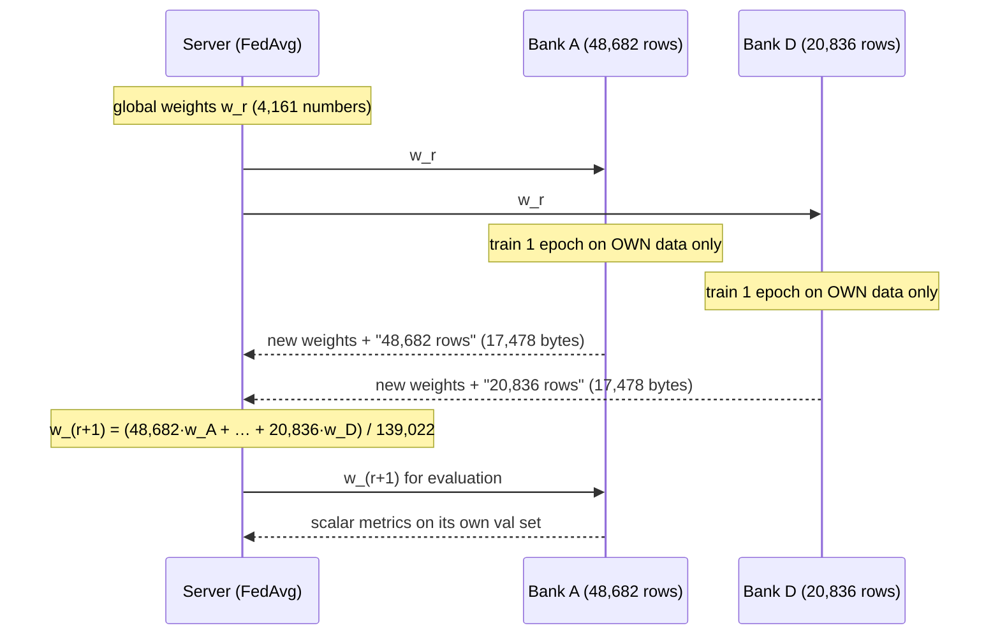

# Step 8: Federated Arms with Flower (Phase 4)

## 1. Goal
Train **one shared fraud model across the four banks without any data leaving a bank**, using Flower and FedAvg. We run **Arm 3** (federated, real data only) and **Arm 4** (federated, real + validated synthetic data, the headline FraudNet-Synth configuration) in a single-machine simulation. Each runs 30 rounds with 1 local epoch per round, and metrics are logged every round, globally and per bank. The decision threshold is chosen from **aggregate counts only**: each bank sends how many of its validation frauds and genuine rows exceed each of 241 fixed cut-offs, never scores or rows. An automated **privacy-invariant test** proves what clients send.

## 2. Concepts explained simply

### One FedAvg round, step by step

(Banks B and C do the same in parallel.)

1. **Server → banks:** the server sends the current global weights.
2. **Local training:** each bank loads those weights and trains for one pass over *its own* data, with its own fraud weighting (D-010).
3. **Banks → server:** each bank sends back **only** the updated 4,161 weights plus its row count: 17,478 bytes per bank per round, whatever its data size.
4. **Averaging:** the new global weights are the average weighted by row count. Bank A (48,682 rows) counts about 2.3× as much as Bank D (20,836).
5. **Repeat** for 30 rounds.

**Analogy:** four chefs improving one shared recipe. Each cooks it in their own kitchen with their own ingredients and writes down their tweaks. A coordinator blends the tweaks (giving more say to chefs who cooked more dishes) into the next version. The ingredients never leave the kitchens.

### Other terms
- **Round / local epoch:** a round is one full cycle above. A local epoch is one pass over a bank's own data within a round (we use 1).
- **Client drift:** with very different banks, long local training pulls each bank's copy towards its own data, so the copies disagree and averaging works less well. One local epoch keeps drift small.
- **Convergence curve:** a metric plotted after every round, showing when the model stops improving.
- **Threshold from summed counts (D-031):** after the last round, the server sends the final model and a fixed list of 241 cut-offs (logits −10 to 50, step 0.25, chosen before seeing any data). Each bank scores its *own* validation rows locally and replies with two integers per cut-off: how many frauds are at or above it (TP) and how many genuine rows are (FP). The server **adds the four banks' counts** and picks the cut-off with the best F1. Adding counts gives exactly the same result as pooling everyone's validation data, without anyone sharing a score or a row (proved by a test).
- **Who holds the global test set?** The *experimenter*, not any bank. It's used to report results and to draw the convergence plot. The final model is always round 30's; we never pick "the best round on test", which would be leakage.

## 3. What we built
| File | What it does |
|---|---|
| `configs/fl.yaml` | 30 rounds, 1 local epoch, all banks every round, threshold grid, Ray resources |
| `ml/federated/common.py` | Bank list; `bank_data()` (loads **only** that bank's folder, with Arm 2's synthetic sample for Arm 4); `threshold_grid()`; `counts_at_thresholds()`; `best_threshold_from_counts()` |
| `ml/federated/client_app.py` | Flower `ClientApp` (flwr 1.39 Message API): `train_fn` (weights + scalars), `evaluate_fn` (scalars on own val), `query_fn` (threshold counts / own local-test metrics) |
| `ml/federated/server_app.py` | Flower `ServerApp`: `OrderedFedAvg` (FedAvg with a fixed aggregation order, D-032), per-bank round logging, the global-test convergence evaluator, the two count-only queries, saving results |
| `ml/federated/run.py` | Runs the single-machine simulation (Ray backend, 4 virtual banks) for both arms, then writes tables and plots |
| `tests/test_privacy_invariant.py` | 5 tests on the **real client handlers**: a train reply = exactly the model's 4,161 weights + scalars (< 40 KB); evaluate/query replies = scalars or ≤ 241 integer counts; no config/data records; the client opens files **only inside its own bank folder** |
| `tests/test_federated_threshold.py` | 3 tests: grid fixed and data-free; counts match the confusion matrix; summed bank counts = pooled counts, and the chosen cut-off is optimal on pooled data |

## 4. How to run it
```powershell
.venv\Scripts\activate
python -m ml.federated.run                  # Arms 3 and 4, ~45 s each on CPU (incl. Ray start-up)
pytest tests/test_privacy_invariant.py tests/test_federated_threshold.py -q
```

## 5. Evidence (real output, seed 42, 2026-10-08)
Files: `results/federated/arm3_federated_real_seed42.json`, `arm4_federated_aug_seed42.json`, `global_test_table.csv`, `local_test_table.csv`, `console_output_full.txt` and `console_output_rerun.txt` (identical second run).

**Flower version:** flwr 1.39.0, Message API (`ServerApp`, `ClientApp`, `flwr.serverapp.strategy.FedAvg`), `run_simulation` with the Ray backend, 2 CPUs per virtual bank.

**Global test set (95 frauds), final round 30, threshold from summed bank counts:**
| Arm | Threshold (logit) | Precision | Recall | **F1** | **PR-AUC** | ROC-AUC | Accuracy | TP / FP / FN | Training time |
|---|---|---|---|---|---|---|---|---|---|
| 3 Federated, real | 3.75 | 0.8642 | 0.7368 | **0.7955** | **0.7261** | 0.9584 | 0.9994 | 70 / 11 / 25 | 36.4 s |
| 4 Federated, aug | 3.75 | 0.8000 | 0.7579 | **0.7784** | **0.7231** | 0.9622 | 0.9993 | 72 / 18 / 23 | 38.4 s |

**Threshold step:** both arms chose logit 3.75. On the pooled validation counts (49 frauds) that gave F1 0.7556 (34 TP, 7 FP) in both arms. That's a coincidence at this small sample size: Arm 4 really did train with the synthetic rows (per-bank training sizes 48,787 / 41,801 / 27,813 / 20,854 vs 48,682 / 41,719 / 27,785 / 20,836 for Arm 3), and the two models differ on the global test.

**Convergence (global test PR-AUC after each round):**
| Round | 1 | 5 | 10 | 15 | 20 | 25 | 30 |
|---|---|---|---|---|---|---|---|
| Arm 3 | 0.706 | 0.720 | 0.720 | 0.728 | 0.725 | 0.726 | 0.726 |
| Arm 4 | 0.709 | 0.722 | 0.727 | 0.724 | 0.727 | 0.727 | 0.723 |

Both curves plateau from about round 13–15 (charts: `convergence_global_pr_auc.png`; note its y-axis spans only 0.705–0.730, so wiggles of ±0.003 look large).

**Per-bank view** (`convergence_per_bank_arm3_federated_real.png`, `…_arm4_federated_aug.png`): every bank's local training loss falls from round 1. The global model's PR-AUC on Bank D's own validation set rises from 0.17 to 0.38, and on Bank B's from 0.62 to 0.74, as federation brings in the other banks' knowledge.

**Communication:** each bank uploads **17,478 bytes per round** (4,161 float32 weights plus record overhead), identical for all banks whatever their data size. Over 30 rounds that's about 0.5 MB per bank. No data rows are transmitted.

**Local test sets** (each bank scores the final global model itself; frauds A 22, B 17, C 6, D 4). F1 / PR-AUC:
| Bank | Arm 3 (fed, real) | Arm 4 (fed, aug) | For reference: Arm 1 (isolated, real) |
|---|---|---|---|
| A | 0.8293 / 0.7547 | 0.7907 / 0.7431 | 0.7727 / 0.7431 |
| B | 0.7692 / 0.6561 | 0.7895 / 0.6302 | 0.6857 / 0.6130 |
| C | 0.9091 / 1.0000 | 0.9231 / 1.0000 | 0.8000 / 0.9762 |
| D | **0.7500** / 0.6458 | 0.6667 / 0.6042 | **0.0000** / 0.4939 |

Bank D's own isolated model caught **0 of 4** of its local test frauds; the federated model catches **3 of 4**.

**Federated vs the Step 7 arms (global test, seed 42 only):**
| Arm | F1 | PR-AUC |
|---|---|---|
| 1 Isolated real (A / B / C / D) | 0.811 / 0.795 / 0.680 / 0.406 | 0.712 / 0.715 / 0.712 / 0.686 |
| **3 Federated real** | **0.796** | **0.726** |
| 5 Centralized real | 0.781 | 0.723 |
| 2 Isolated aug (A / B / C / D) | 0.777 / 0.788 / 0.680 / 0.496 | 0.704 / 0.728 / 0.710 / 0.672 |
| **4 Federated aug** | **0.778** | **0.723** |
| 6 Centralized aug | 0.721 | 0.725 |

**Tests:** 43 passed in total (5 privacy-invariant, 3 threshold).

**Reproducibility:** after fix D-032, two full runs were **bit-identical** (every round, every bank, thresholds, local and global metrics).

## 6. Explain it to the guide (script)
"Sir, in Step 8 I trained one shared model across the four banks using Flower and FedAvg, without moving any data. In each of 30 rounds, the server sends the current model to every bank; each bank trains it for one pass on its own data and sends back only the updated weights, 17 kilobytes, plus its row count. The server then averages the weights, giving bigger banks more say. To choose the alert threshold without sharing scores, each bank sends only counts: how many of its validation frauds and genuine transactions exceed each of 241 fixed cut-offs. The server adds the counts and picks the best cut-off, and a test proves this equals pooling the validation data. Federated learning reached an F1 of 0.80 and a PR-AUC of 0.73 on the global test, essentially the same as pooling all the data centrally, which isn't legally possible. The small banks benefit most: Bank D alone caught none of its 4 local test frauds, but the federated model catches 3. Adding synthetic data in the federated setting did not help in this run. An automated privacy test checks that clients only ever return weights, scalar metrics and counts, and only read their own bank's folder."

## 7. Likely viva questions
1. **What exactly leaves a bank in FedAvg?** The 4,161 model weights (17,478 bytes per round), the number of training rows, and scalar metrics. After training, also integer TP/FP counts at fixed cut-offs and scalar local-test metrics. Never data rows or per-transaction scores. `test_privacy_invariant.py` checks this on the real client code.
2. **How is the federated threshold chosen without sharing scores?** The server fixes 241 cut-offs in advance. Each bank counts its validation frauds and genuine rows above each cut-off and sends only the counts. The server sums them and picks the best F1. Summing counts is mathematically identical to pooling the validation data.
3. **Why weight the average by row count?** A bank that trained on more examples gives a more reliable update. That's what FedAvg defines, and it makes the result close to training on the union of the data.
4. **Why 30 rounds and 1 local epoch?** One epoch limits client drift across our very unequal banks. Thirty rounds gives FedAvg time to converge, and the curve shows it plateaued by around rounds 13–15. These were decisions D-029/D-030; 30 rounds is twice the training effort of the non-federated arms, which we state openly.
5. **Why did two identical runs first give different results, and how was that fixed?** Banks train in parallel, so their replies arrive in varying order. Adding floating-point numbers in a different order gives tiny rounding differences, which training amplified. Sorting replies by bank before averaging made runs bit-identical without changing the FedAvg maths (D-032).

## 8. Limitations and honest notes
- **Single seed.** Federated (0.796 F1) slightly exceeding centralized (0.781) is within the noise we saw in Step 7. We do **not** claim FL beats pooling. Step 9 repeats everything over several seeds.
- **Augmentation did not help federated training here:** F1 −0.017 (0.796 → 0.778), PR-AUC −0.003. Recall rose slightly (+2 TP) but precision fell (+7 FP). This matches the mixed picture of Step 7. Reported plainly.
- **Training effort is not matched:** 30 rounds × 1 epoch = 30 passes over each bank's data, vs 15 epochs for isolated and centralized models (D-029). The plateau around round 15 suggests the extra rounds add little, but a strict comparison would need equal effort.
- **Optimiser state resets each round:** each bank starts a fresh Adam optimiser every round, so clients keep no memory between rounds. This is standard in simple FedAvg setups, and it means clients store nothing between rounds.
- **The count-based threshold reveals some aggregate information:** a bank's TP/FP counts at 241 cut-offs describe how its validation scores are distributed (as totals, not per row). This fits our "aggregate metrics only" rule, but it isn't formal privacy (differential privacy is Future Scope).
- **Simulation, not a network:** all four banks ran on one laptop via Ray. The multi-laptop network demo is Step 8B.
- **Local test sets remain tiny** (C: 6, D: 4 frauds). Bank D's "3 of 4" is encouraging but statistically weak.
- **Literature reference points** (≈91% federated vs ≈95% centralized accuracy; FedFraud F1 0.90) aren't compared yet. That comes in Step 9 with multi-seed results. Our accuracies are all ≥ 99.93%, which shows again why accuracy isn't our headline metric.

## 9. Next step
**Step 8B: Multi-device federated demo** (the four-laptop live demo planned with your guide, D-020), then **Step 9: the six-arm runner**, which repeats all six arms over several seeds and reports mean ± standard deviation, the per-bank augmentation delta table and an honest interpretation against the literature.
